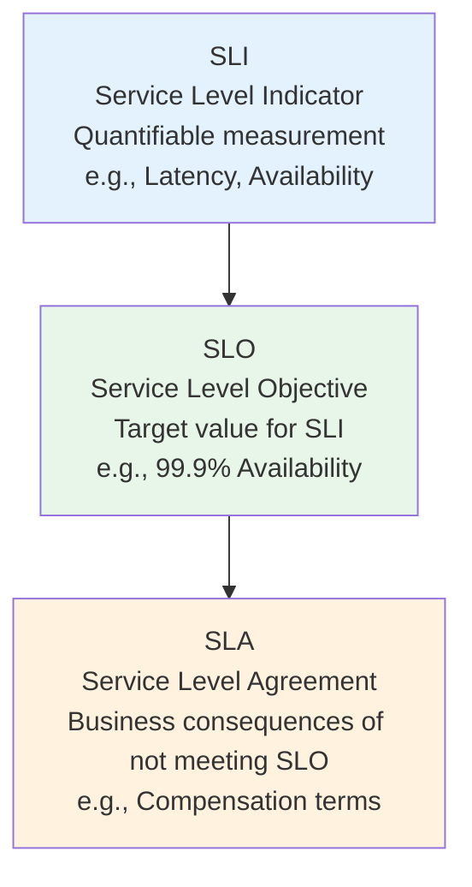
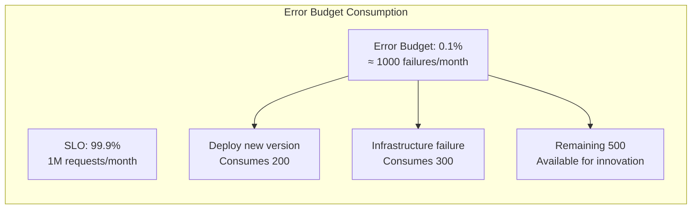
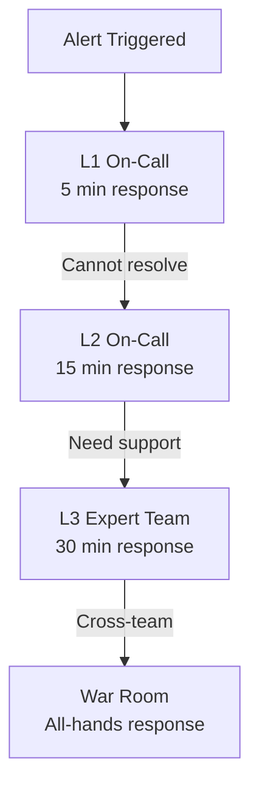
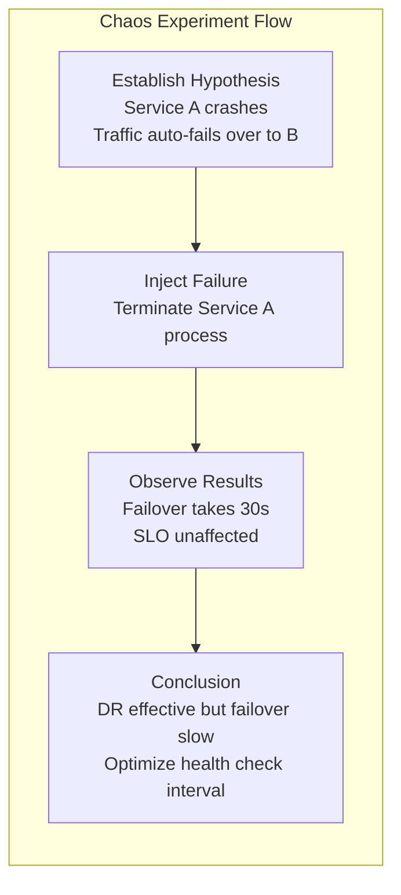
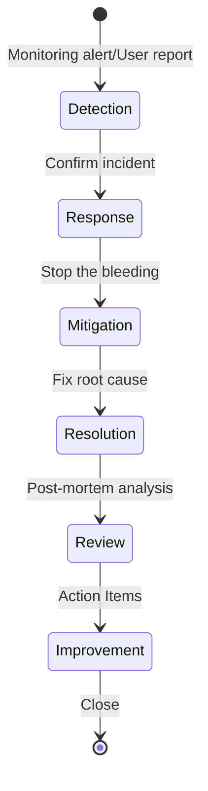
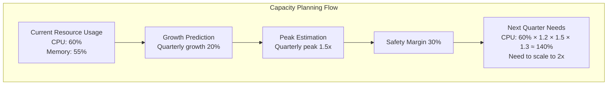

## SRE Overview

Site Reliability Engineering (SRE) is a methodology proposed by Google that applies software engineering approaches to solve operations problems. SRE's core philosophy is that operations problems are essentially software problems and should be solved systematically through engineering practices.

SRE is not a job title but a system. It defines methods for measuring reliability, strategies for handling failures, and mechanisms for managing risk.

## SLI/SLO/SLA Framework

This is the measurement cornerstone of SRE, progressing from bottom to top:



### SLI Selection

SLIs should reflect real user experience, not internal metrics:

| Service Type | Recommended SLI | Anti-Pattern |
|-------------|----------------|-------------|
| API Service | Request success rate, latency | CPU usage |
| Web Frontend | Page load time, FCP | Server load |
| Storage | Data durability, I/O latency | Disk usage |
| Message Queue | Message delivery latency, message loss rate | Queue length |

### SLO Formulation

Higher SLOs aren't always better. A 100% SLO means no changes are allowed, and the system will stagnate. A reasonable SLO balances user experience with development velocity:

```yaml
# SLO definition example (SLO Generator format)
service: api-gateway
slos:
  - name: availability
    description: "API request success rate"
    sli:
      type: good_bad_ratio
      good: sum(rate(http_requests_total{status=~"2.."}[5m]))
      bad: sum(rate(http_requests_total{status!~"2.."}[5m]))
    target: 99.9%
    window: 30d

  - name: latency
    description: "API P99 latency"
    sli:
      type: threshold
      metric: histogram_quantile(0.99, rate(http_request_duration_seconds_bucket[5m]))
      threshold: 500ms
    target: 99%
    window: 30d
```

### Error Budget

Error Budget is the inverse of SLO: 1 - SLO = allowed failure space.



**Practical Implications of Error Budgets**:

- Budget is ample: Team can boldly release new features and refactor architecture
- Budget is exhausted: Team stops non-urgent changes, focuses on reliability improvements
- Budget consistently remaining: SLO is too loose, should raise targets to drive improvement

## On-Call Practices

On-Call is SRE's front-line work, ensuring someone responds to and handles system failures.

### On-Call Principles

1. **Reasonable alert volume**: No more than 2 page-level alerts per week, otherwise On-Call personnel will experience fatigue
2. **Clear escalation path**: L1 → L2 → L3, each level has time limits
3. **Post-incident review**: Every On-Call incident must have a post-mortem analysis
4. **Rotation mechanism**: Avoid the same person being On-Call long-term



### Alert Severity Levels

| Level | Response Time | Notification Method | Example |
|-------|--------------|--------------------| -------|
| P1 - Critical | 5 minutes | Phone + SMS | Production service unavailable |
| P2 - High | 15 minutes | SMS + IM | Partial feature degradation |
| P3 - Medium | 1 hour | IM notification | Latency increase |
| P4 - Low | 24 hours | Email | Disk usage > 70% |

### On-Call Handoff Checklist

- Incidents this week and their handling status
- Pending Action Items
- SLOs / Error budgets approaching limits
- Planned changes and potential impact

## Chaos Engineering

Chaos engineering is an experimental method that proactively injects failures to verify system resilience. The core idea is to discover system weaknesses before failures affect users.

### Chaos Engineering Principles

1. **Establish steady-state hypothesis**: Define "normal" behavior metrics for the system
2. **Simulate real events**: Inject server crashes, network latency, dependency unavailability, etc.
3. **Observe system behavior**: Compare metric changes before and after injection
4. **Learn and improve**: Harden the system based on experimental results



### Chaos Monkey vs Chaos Mesh

| Tool | Platform | Failure Types |
|------|----------|--------------|
| Chaos Monkey | Netflix/Spinnaker | Random instance termination |
| Chaos Mesh | K8s | Pod failures, network failures, I/O failures |
| Litmus | K8s | Comprehensive chaos experiments |
| Gremlin | All platforms | Commercial solution, visual experiments |

### Chaos Mesh Experiment Example

```yaml
apiVersion: chaos-mesh.org/v1alpha1
kind: NetworkChaos
metadata:
  name: api-latency
  namespace: chaos-testing
spec:
  action: delay
  mode: one
  selector:
    namespaces: ["production"]
    labelSelectors:
      app: api
  delay:
    latency: "500ms"
    correlation: "50"
    duration: "5m"
```

## Incident Management

### Incident Lifecycle



### Incident Response Principles

1. **Stop the bleeding first, find root cause later**: Rapid service restoration takes priority over finding root cause
2. **Single incident commander**: One person coordinates, others focus on technical work
3. **Frequent updates**: Sync status to stakeholders every 15-30 minutes
4. **Preserve the scene**: Don't rush to restart, preserve logs and forensic information

### Blameless Post-Mortem

The core principle of post-mortems: **Focus on the process, not the person** (no individual blame, but finding systemic issues).

Post-mortem template:

```text
## Incident Post-Mortem

### Basic Information
- Incident time: 2026-05-01 14:30 - 15:45
- Impact scope: API service 30% request failures
- Impact duration: 75 minutes
- SLO impact: Consumed 15% of monthly error budget

### Timeline
- 14:30 - Alert triggered: API error rate rising
- 14:35 - On-Call confirmed incident, started investigation
- 14:45 - Identified: Database connection pool exhausted
- 15:00 - Mitigated: Scaled database connection pool
- 15:15 - Service restored to normal
- 15:45 - Confirmed no recurrence

### Root Cause Analysis
Database connection pool configuration was not adjusted as traffic grew, causing connection wait timeouts under high concurrency

### Action Items
1. [P0] Connection pool config auto-scales with HPA (Owner: Zhang San, Due: 5/7)
2. [P1] Add connection pool usage alerting (Owner: Li Si, Due: 5/5)
3. [P2] Integrate Chaos Mesh to simulate connection pool exhaustion (Owner: Wang Wu, Due: 5/14)
```

## Capacity Planning

Capacity planning ensures the system has enough resources to handle traffic as the business grows:

### Planning Methodology

1. **Current baseline**: Collect resource usage trend data
2. **Growth rate prediction**: Project future needs based on historical data
3. **Safety margin**: Reserve 30% buffer for unexpected traffic spikes
4. **Milestone reviews**: Quarterly review of forecast vs actual deviation



### Key Metrics

| Dimension | Metric | Purpose |
|-----------|--------|---------|
| Compute | CPU/Memory usage trends | Determine node scaling |
| Storage | Disk growth rate | Predict scaling timeline |
| Network | Bandwidth usage trends | Plan bandwidth upgrades |
| Business | DAU/Request volume growth | Drive all resource planning |

### Automated Capacity Management

```yaml
# K8s VPA auto-recommend resource quotas
apiVersion: autoscaling.k8s.io/v1
kind: VerticalPodAutoscaler
metadata:
  name: api-vpa
spec:
  targetRef:
    apiVersion: apps/v1
    kind: Deployment
    name: api
  updatePolicy:
    updateMode: Off  # Recommend only, don't auto-modify
  resourcePolicy:
    containerPolicies:
      - mode: Auto
```

SRE is not about preventing system failures — that's impossible. SRE's goal is to give systems the ability to recover quickly and to continuously learn and improve from failures. From SLI/SLO measurement to On-Call response, from chaos engineering verification to blameless post-mortem growth, SRE makes reliability an engineering-driven, repeatable practice.
