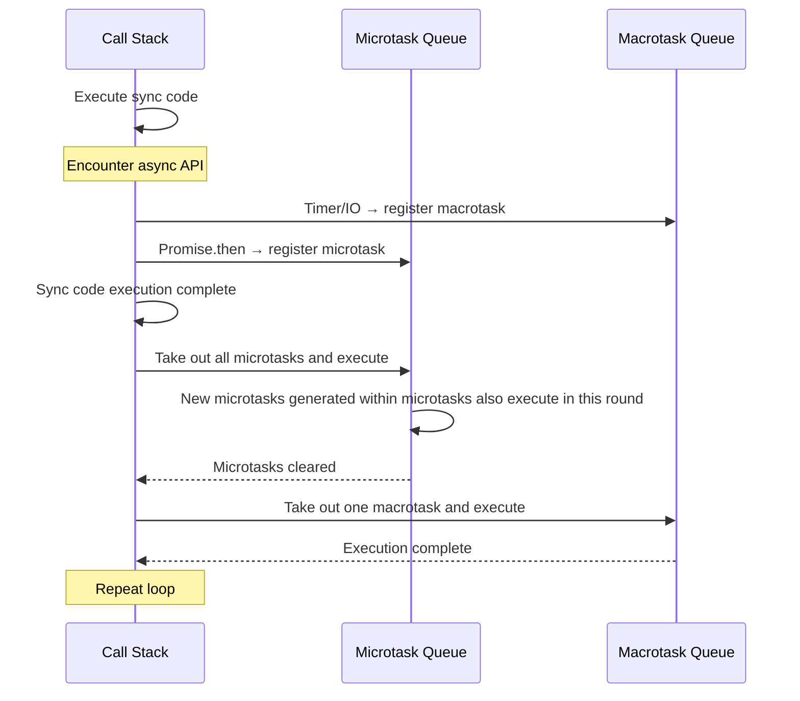

## Browser Event Loop

JavaScript is a single-threaded language, but the browser doesn't rely on just one thread. The Event Loop is the scheduling mechanism that coordinates the call stack with task queues.



**Macrotasks**: `setTimeout`, `setInterval`, I/O, UI rendering, `requestAnimationFrame`, event callbacks

**Microtasks**: `Promise.then/catch/finally`, `MutationObserver`, `queueMicrotask`

**Core rule**: After each macrotask completes, all microtasks must be cleared before the next macrotask executes.

```javascript
console.log("1");                    // Sync
setTimeout(() => console.log("2"));   // Macrotask
Promise.resolve().then(() => {        // Microtask
  console.log("3");
  Promise.resolve().then(() => console.log("4")); // Microtask within microtask
});
console.log("5");                    // Sync
// Output: 1, 5, 3, 4, 2
```

## Promise Chaining and Error Handling

A Promise represents the eventual result of an asynchronous operation—three states: **pending → fulfilled** or **pending → rejected**, and once determined, the state is irreversible.

### Chaining

```javascript
fetch("/api/user/1")
  .then(res => res.json())       // Returns new Promise
  .then(user => fetch(`/api/posts?userId=${user.id}`))
  .then(res => res.json())
  .then(posts => renderPosts(posts))
  .catch(err => console.error("Error at any step in chain:", err));
```

`then` returns a new Promise, forming a chain. `catch` is syntactic sugar for `.then(null, onRejected)`, catching errors at any point in the chain.

### Error Handling Best Practices

```javascript
// Not recommended: swallowing errors
async function loadUser() {
  const res = await fetch("/api/user");
  return res.json(); // Network errors silently swallowed
}

// Recommended: explicit error handling
async function loadUser() {
  try {
    const res = await fetch("/api/user");
    if (!res.ok) throw new Error(`HTTP ${res.status}`);
    return await res.json();
  } catch (err) {
    console.error("Failed to load user:", err.message);
    return null; // Graceful degradation
  }
}
```

## async/await Principles

`async/await` is syntactic sugar over Promises, making async code look like sync code:

```javascript
// Promise style
function loadDashboard() {
  return fetchUser()
    .then(user => fetchPosts(user.id))
    .then(posts => ({ user, posts }));
}

// async/await style
async function loadDashboard() {
  const user = await fetchUser();
  const posts = await fetchPosts(user.id);
  return { user, posts };
}
```

An `async` function always returns a Promise. `await` pauses function execution, continuing after the Promise resolves. **Note**: `await` only pauses the current async function—it doesn't block the main thread.

### Parallel Execution

```javascript
// Sequential — total time = A + B
const a = await taskA(); // Wait for A to complete
const b = await taskB(); // Then wait for B

// Parallel — total time = max(A, B)
const [a, b] = await Promise.all([taskA(), taskB()]);
```

## Concurrency Control: Promise Combinators

| Method | Behavior | All Succeed | One Fails |
|------|------|----------|------------|
| `Promise.all` | Wait for all | Return result array | First rejection |
| `Promise.allSettled` | Wait for all | Return status+value array | Never rejects |
| `Promise.race` | First to finish | First result | First rejection |
| `Promise.any` | First to succeed | First success | Rejects only if all fail |

```javascript
// Batch requests, tolerate partial failures
const results = await Promise.allSettled([
  fetch("/api/a"),
  fetch("/api/b"),
  fetch("/api/c"),
]);
const succeeded = results
  .filter(r => r.status === "fulfilled")
  .map(r => r.value);
```

**Practical selection**: Need all to succeed → `all`, tolerate partial failures → `allSettled`, timeout racing → `race`, prioritize first success → `any`.

## Async Patterns in Practice

### Request Cancellation

```javascript
const controller = new AbortController();

fetch("/api/data", { signal: controller.signal })
  .then(res => res.json())
  .catch(err => {
    if (err.name === "AbortError") {
      console.log("Request cancelled");
    }
  });

// Cancel when user navigates away
controller.abort();
```

### Retry Mechanism

```javascript
async function fetchWithRetry(url, retries = 3, delay = 1000) {
  for (let i = 0; i < retries; i++) {
    try {
      const res = await fetch(url);
      if (!res.ok) throw new Error(`HTTP ${res.status}`);
      return await res.json();
    } catch (err) {
      if (i === retries - 1) throw err;
      await new Promise(r => setTimeout(r, delay * (i + 1))); // Exponential backoff
    }
  }
}
```

### Debounce and Throttle

```javascript
// Debounce: delay execution, reset timer on repeated triggers
function debounce(fn, delay) {
  let timer;
  return (...args) => {
    clearTimeout(timer);
    timer = setTimeout(() => fn(...args), delay);
  };
}

// Throttle: execute at fixed intervals, ignore repeated triggers within interval
function throttle(fn, interval) {
  let last = 0;
  return (...args) => {
    const now = Date.now();
    if (now - last >= interval) {
      last = now;
      fn(...args);
    }
  };
}
```

**Selection guide**: Search box input → debounce (wait for user to pause before searching); scroll events → throttle (process at fixed frequency); window resize → debounce (wait for adjustment to finish before recalculating layout).
