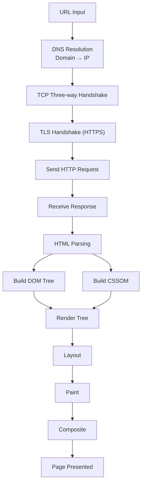
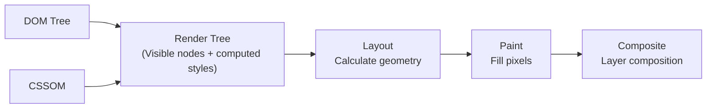
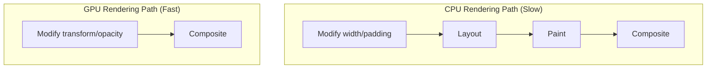

## From URL Input to Page Rendering

After entering a URL in the browser address bar and pressing Enter, the full pipeline roughly looks like this:



Key steps explained:

1. **DNS Resolution**: Browser cache → OS cache → Router cache → ISP DNS → Recursive query. `dns-prefetch` can resolve domains in advance
2. **TCP Connection**: Three-way handshake establishes a reliable connection. After HTTP/2 multiplexing, the same connection can handle parallel requests
3. **HTTP Request/Response**: Request headers carry cache info (If-Modified-Since, ETag), response may be 304 using cache directly

## HTML Parsing and DOM/CSSOM Construction

### DOM Tree Construction

The HTML parser processes the document **incrementally**—it doesn't need to wait for the entire document to download:

1. **Bytes → Characters**: Decode byte stream to characters based on encoding (UTF-8)
2. **Characters → Tokens**: Lexical analysis, identifying tag names, attributes, text
3. **Tokens → Nodes**: Create DOM nodes from tokens
4. **Nodes → DOM Tree**: Assemble tree structure based on nesting relationships

**Key detail**: Encountering a `<script>` tag pauses DOM construction, because scripts may modify the DOM. The `async` and `defer` attributes can change this behavior.

### CSSOM Construction

CSS parsing can proceed in parallel with DOM parsing, but CSS blocks rendering—CSSOM must be fully constructed before proceeding to the next step, because styles may affect layout.

## Rendering Pipeline



### Render Tree

The Render Tree only contains **visible nodes**. Elements with `display: none` are not in the Render Tree (no space occupied); elements with `visibility: hidden` are in the Render Tree (space occupied but invisible). `::before`/`::after` pseudo-elements also appear in the Render Tree.

### Layout (Reflow)

Calculates the precise position and size of each node—x, y, width, height. This is the mapping from Render Tree to geometric information.

### Paint

Converts laid-out nodes into pixels on the screen. Painting is divided into multiple layers: background color → background image → border → child elements → outline.

### Composite

Composites different layers in the correct order to produce the final image. Elements with independent layers can be updated without affecting other layers.

## Reflow and Repaint

### Reflow

Reflow is triggered when layout information changes, recalculating the geometric properties of affected nodes. Operations that trigger reflow:

- Adding/removing DOM elements
- Modifying `width`, `height`, `padding`, `margin`, `position`
- Reading layout-forcing properties like `offsetWidth`, `scrollTop`, `getComputedStyle()`
- Window resize, font changes

### Repaint

Repaint is triggered when visual properties change without affecting layout. Such as modifying `color`, `background`, `visibility`, `box-shadow`.

### Optimization Strategies

```javascript
// Bad: modifying styles one by one, each may trigger reflow
element.style.width = "100px";
element.style.height = "200px";
element.style.margin = "10px";

// Good: batch modification, only one reflow
element.style.cssText = "width:100px;height:200px;margin:10px;";

// Good: use class switching
element.classList.add("expanded");

// Good: modify after removing from document flow
element.style.display = "none";       // Trigger one reflow
element.style.width = "100px";        // Not visible, no reflow
element.style.height = "200px";
element.style.display = "";           // Trigger one reflow

// Good: use DocumentFragment for batch insertion
const fragment = document.createDocumentFragment();
items.forEach(item => fragment.appendChild(createItem(item)));
container.appendChild(fragment); // Only one reflow
```

**Read-write separation**: Avoid alternating reads and writes of layout properties within the same frame, as this forces synchronous layout.

## Critical Rendering Path Optimization

The critical rendering path is the shortest path from receiving HTML to the first pixel render. Optimization goal: **achieve First Meaningful Paint (FMP) as quickly as possible**.

```html
<!-- CSS in head, start building CSSOM early -->
<link rel="stylesheet" href="style.css">

<!-- Non-critical CSS loaded asynchronously -->
<link rel="stylesheet" href="print.css" media="print" onload="this.media='all'">

<!-- JS at bottom of body, or use defer -->
<script src="app.js" defer></script>

<!-- Preload critical resources -->
<link rel="preload" href="critical-font.woff2" as="font" crossorigin>
<link rel="preconnect" href="https://cdn.example.com">
```

Key strategies:
- **Reduce critical resource count**: Load non-critical CSS/JS asynchronously
- **Reduce critical resource size**: Compression, Tree-shaking, inline critical CSS
- **Shorten critical path length**: `defer` lets JS not block parsing

## GPU Acceleration and Composite Layers

Certain CSS properties can promote elements to independent composite layers, handled by the GPU:

```css
/* Common ways to trigger composite layers */
.gpu-accelerated {
  transform: translateZ(0);     /* Classic hack */
  will-change: transform;       /* Modern approach, hints browser to pre-optimize */
  /* Or opacity + transform combination animation */
}
```

**Why GPU acceleration is fast**: Changes to `transform` and `opacity` don't require Layout and Paint—they only go through the Composite stage. The GPU excels at bitmap transformations (moving, rotating, scaling, opacity).

**Caveats**: Too many layers increase memory consumption (each layer is an independent bitmap), which is especially sensitive on mobile. Only use `will-change` on animated elements, and remove it after the animation ends.



Summary: The significance of understanding the rendering pipeline is knowing which operations are expensive (reflow) and which are cheap (compositing), so you can make the right choices at the code level.
