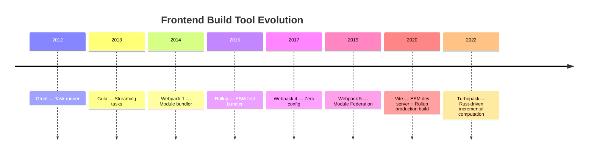
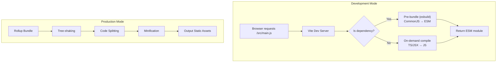

## Build Tool Evolution



| Tool | Positioning | Dev Experience | Build Speed | Use Case |
|------|------|----------|----------|----------|
| Webpack | All-purpose bundler | Complex config, slow start | Slow (30s+ for large projects) | Complex apps, legacy projects |
| Rollup | Library bundler | Simple | Moderate | Library/NPM package development |
| Vite | Next-gen build | Lightning HMR | Fast (millisecond HMR) | First choice for new projects |
| Turbopack | Incremental computation | Extremely fast | Extremely fast (Rust) | Next.js integration |

## Vite Core Principles

Vite's core philosophy: **use native browser ESM in development, Rollup for production bundling**.



### Why is Vite Fast?

1. **No bundling, on-demand compilation**: In development, there's no need to bundle the entire app—compile only the module the browser requests
2. **esbuild pre-bundling**: esbuild, written in Go, handles dependency pre-bundling 10-100x faster than JS tools
3. **Precise HMR**: After modifying a file, only that module and its dependency chain are recompiled—no need to re-bundle the entire app

```javascript
// vite.config.js
import { defineConfig } from "vite";
import react from "@vitejs/plugin-react";

export default defineConfig({
  plugins: [react()],
  build: {
    rollupOptions: {
      output: {
        manualChunks: {
          vendor: ["react", "react-dom"],
          utils: ["lodash-es"],
        },
      },
    },
  },
  server: {
    proxy: {
      "/api": "http://localhost:3000",
    },
  },
});
```

### Vite Plugin System

Vite plugins extend the Rollup plugin interface with Vite-specific hooks:

| Hook | Phase | Purpose |
|------|------|------|
| `configResolved` | After config resolution | Read final configuration |
| `configureServer` | Server startup | Add middleware, custom routes |
| `transformIndexHtml` | HTML transform | Inject scripts, modify head |
| `handleHotUpdate` | HMR trigger | Custom hot update logic |

## Module Federation

Module Federation allows multiple independently built applications to share modules at runtime:

```javascript
// App A (Host) — webpack.config.js
new ModuleFederationPlugin({
  name: "host",
  remotes: {
    remoteApp: "remoteApp@http://cdn.example.com/remoteEntry.js",
  },
});

// App B (Remote) — webpack.config.js
new ModuleFederationPlugin({
  name: "remoteApp",
  filename: "remoteEntry.js",
  exposes: {
    "./UserProfile": "./src/components/UserProfile",
  },
  shared: {
    react: { singleton: true },
    "react-dom": { singleton: true },
  },
});
```

```jsx
// In App A, directly reference App B's component
const UserProfile = React.lazy(() => import("remoteApp/UserProfile"));
```

Use cases: **micro-frontends**, **independent team independent deployment**, **shared component library runtime loading**.

## Tree-shaking Principles

Tree-shaking uses static analysis of ES Modules to remove unused exports:

```javascript
// utils.js
export function used() { return "I am used"; }
export function unused() { return "I am not used"; }

// main.js
import { used } from "./utils.js";
console.log(used()); // unused() won't appear in final bundle
```

**Requirements for Tree-shaking**:
1. Must use ES Modules (`import/export`); CommonJS `require` is dynamic and cannot be analyzed
2. Exports must be explicitly referenced, not accessed through dynamic properties
3. Side effects flag: `"sideEffects": false` in `package.json` tells the bundler this package has no side effects and can safely remove unused code

```javascript
// Has side effects — cannot Tree-shake
export default {
  install(Vue) { Vue.component("MyPlugin", Component); }, // Side effect: registers component
};

// No side effects — can Tree-shake
export function useFeature() { return ref(0); } // Pure function
```

## Build Performance Optimization

### Caching Strategy

```javascript
// Vite cache configuration
export default defineConfig({
  cacheDir: "node_modules/.vite", // Default cache for pre-bundling results
  build: {
    rollupOptions: {
      output: {
        // Content hash for long-term caching
        chunkFileNames: "assets/[name]-[hash].js",
        entryFileNames: "assets/[name]-[hash].js",
        assetFileNames: "assets/[name]-[hash][extname]",
      },
    },
  },
});
```

### Parallel Compilation

```javascript
// Vite uses esbuild for pre-bundling (naturally parallel)
// Can also use worker threads for parallel processing
import { workerThreads } from "node:worker_threads";

// SWC replacing Babel — Written in Rust, parallel compilation
// @vitejs/plugin-react-swc replaces @vitejs/plugin-react
```

### Incremental Builds

```bash
# Vite dev mode is naturally incremental — only compiles changed modules
# Production build incremental compilation is still evolving
vite build --watch  # Watch mode

# Turbopack's incremental computation — caches results at function level
# next dev --turbo
```

### Bundle Analysis

```bash
# Analyze bundle size
npx vite-bundle-visualizer

# Or use rollup-plugin-visualizer
import { visualizer } from "rollup-plugin-visualizer";
plugins: [visualizer({ open: true })]
```

Through visual analysis, discover: oversized dependencies, duplicate bundling, un-Tree-shaken modules, and optimize accordingly.
