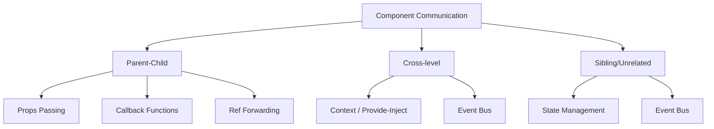

## Component Design Principles

### Single Responsibility

A component should do one thing. The criterion: if a component has more than one reason to change, it has too many responsibilities.

```jsx
// Bad: UserProfile both displays and edits information
function UserProfile({ user, onSave }) { /* ... */ }

// Good: Split display and editing
function UserProfileCard({ user }) { /* Read-only display */ }
function UserProfileForm({ user, onSave }) { /* Edit form */ }
```

### Interface Contract

A component's Props are its API. Good interface design follows:

- **Minimality**: Only pass necessary data, not entire objects
- **Clarity**: Use TypeScript to define Props types
- **Defaults**: Provide reasonable defaults for optional Props

```typescript
interface ButtonProps {
  variant: "primary" | "secondary" | "danger"; // Union type to limit options
  size?: "sm" | "md" | "lg";                   // Optional, has default
  disabled?: boolean;
  onClick?: () => void;
  children: React.ReactNode;
}
```

### Controlled vs. Uncontrolled

```jsx
// Controlled component: state controlled externally
function Input({ value, onChange }) {
  return <input value={value} onChange={(e) => onChange(e.target.value)} />;
}

// Uncontrolled component: state managed internally
function Input({ defaultValue }) {
  const [value, setValue] = useState(defaultValue);
  return <input value={value} onChange={(e) => setValue(e.target.value)} />;
}
```

**Selection principle**: Form data needs real-time validation/linkage/submission → controlled; simple input doesn't need external awareness → uncontrolled. You can also design to support both modes:

```jsx
function Input({ value: controlledValue, defaultValue, onChange }) {
  const isControlled = controlledValue !== undefined;
  const [internalValue, setInternalValue] = useState(defaultValue);
  const value = isControlled ? controlledValue : internalValue;

  return (
    <input
      value={value}
      onChange={(e) => {
        if (!isControlled) setInternalValue(e.target.value);
        onChange?.(e.target.value);
      }}
    />
  );
}
```

## Component Communication Patterns



| Pattern | Use Case | Characteristics |
|------|----------|------|
| Props / Events | Parent-child | Most direct, clear data flow |
| Provide / Inject | Ancestor-descendant | Cross-level passing, avoids layer-by-layer Props |
| Ref + ImperativeHandle | Parent calls child method | Exposes imperative API (e.g., focus, scroll) |
| State Management | Global sharing | Single data source, cross-component sync |
| Event Bus | Any components | Decoupled but hard to trace, use cautiously |

```jsx
// Ref forwarding: parent component calls child method
const Input = forwardRef((props, ref) => {
  const inputRef = useRef();
  useImperativeHandle(ref, () => ({
    focus: () => inputRef.current.focus(),
    clear: () => { inputRef.current.value = ""; },
  }));
  return <input ref={inputRef} />;
});

// Parent component
const inputRef = useRef();
inputRef.current.focus(); // Imperative call
```

## Reuse Pattern Evolution

### Higher-Order Components (HOC)

```jsx
// Wraps component to inject additional capability
function withAuth(WrappedComponent) {
  return function AuthComponent(props) {
    const { user } = useAuth();
    if (!user) return <Redirect to="/login" />;
    return <WrappedComponent {...props} user={user} />;
  };
}
const ProtectedPage = withAuth(Dashboard);
```

Problems: nesting hell (`withA(withB(withC(Component)))`), unclear Props sources, lost Refs.

### Render Props

```jsx
function MouseTracker({ render }) {
  const [position, setPosition] = useState({ x: 0, y: 0 });
  // ...listen to mouse movement
  return render(position);
}

<MouseTracker render={({ x, y }) => <Cursor x={x} y={y} />} />
```

Problems: callback nesting is hard to read, cannot optimize in `shouldComponentUpdate`.

### Hooks Reuse

```jsx
function useAuth() {
  const [user, setUser] = useState(null);
  const login = useCallback(async (credentials) => {
    const data = await api.login(credentials);
    setUser(data);
  }, []);
  return { user, login, isLoggedIn: !!user };
}

// Usage: logic and state naturally grouped
function Dashboard() {
  const { user, isLoggedIn } = useAuth();
  if (!isLoggedIn) return <Navigate to="/login" />;
  return <h1>Welcome, {user.name}</h1>;
}
```

Hooks have become the mainstream modern reuse pattern: no nesting, clear sources, type-safe.

## Component Library Design

### Design Tokens

Design Tokens are the atomic variables of a design system—colors, spacing, font sizes, shadows, etc.:

```css
:root {
  /* Colors */
  --color-primary-500: #3b82f6;
  --color-danger-500: #ef4444;
  /* Spacing */
  --spacing-xs: 4px;
  --spacing-sm: 8px;
  --spacing-md: 16px;
  /* Font sizes */
  --font-size-sm: 12px;
  --font-size-md: 14px;
  --font-size-lg: 18px;
  /* Border radius */
  --radius-sm: 4px;
  --radius-md: 8px;
}
```

### Theme System

```jsx
// Runtime theme switching
const themes = {
  light: { "--color-bg": "#ffffff", "--color-text": "#1f2328" },
  dark: { "--color-bg": "#0d1117", "--color-text": "#e6edf3" },
};

function ThemeProvider({ theme, children }) {
  return (
    <div style={themes[theme]}>
      {children}
    </div>
  );
}
```

### Accessibility (A11y)

```jsx
function Dialog({ open, onClose, title, children }) {
  return (
    <div role="dialog" aria-modal="true" aria-labelledby="dialog-title"
         hidden={!open}>
      <h2 id="dialog-title">{title}</h2>
      {children}
      <button onClick={onClose} aria-label="Close dialog">✕</button>
    </div>
  );
}
```

Key principles: semantic HTML, ARIA attributes, keyboard operability, color contrast compliance.

## Storybook-Driven Component Documentation and Testing

Storybook provides an isolated development environment for components:

```jsx
// Button.stories.jsx
export default {
  title: "Components/Button",
  component: Button,
  argTypes: {
    variant: { control: "select", options: ["primary", "secondary", "danger"] },
  },
};

export const Primary = {
  args: { variant: "primary", children: "Click Me" },
};

export const Disabled = {
  args: { variant: "primary", disabled: true, children: "Disabled" },
};
```

Value of Storybook:
- **Visual documentation**: Each Story is one usage of the component
- **Interaction testing**: Combined with Playwright for interaction tests
- **Visual regression**: Chromatic screenshot comparison, preventing unexpected style changes
- **Development isolation**: Unaffected by application state, focus on the component itself
