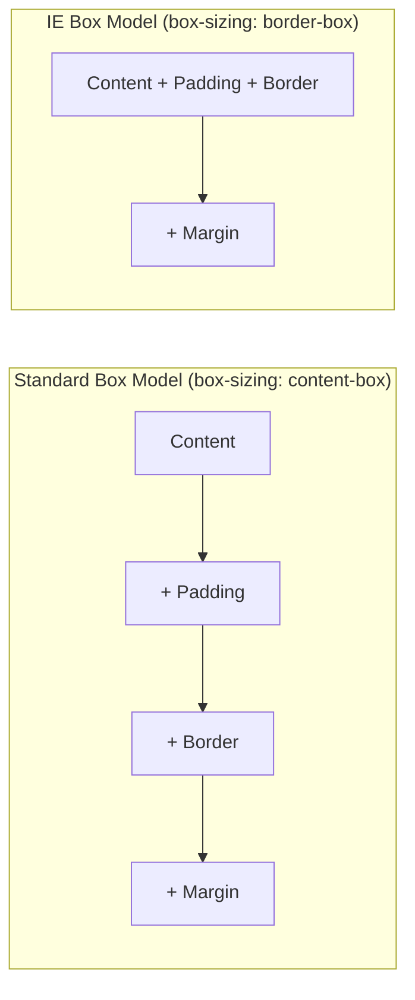
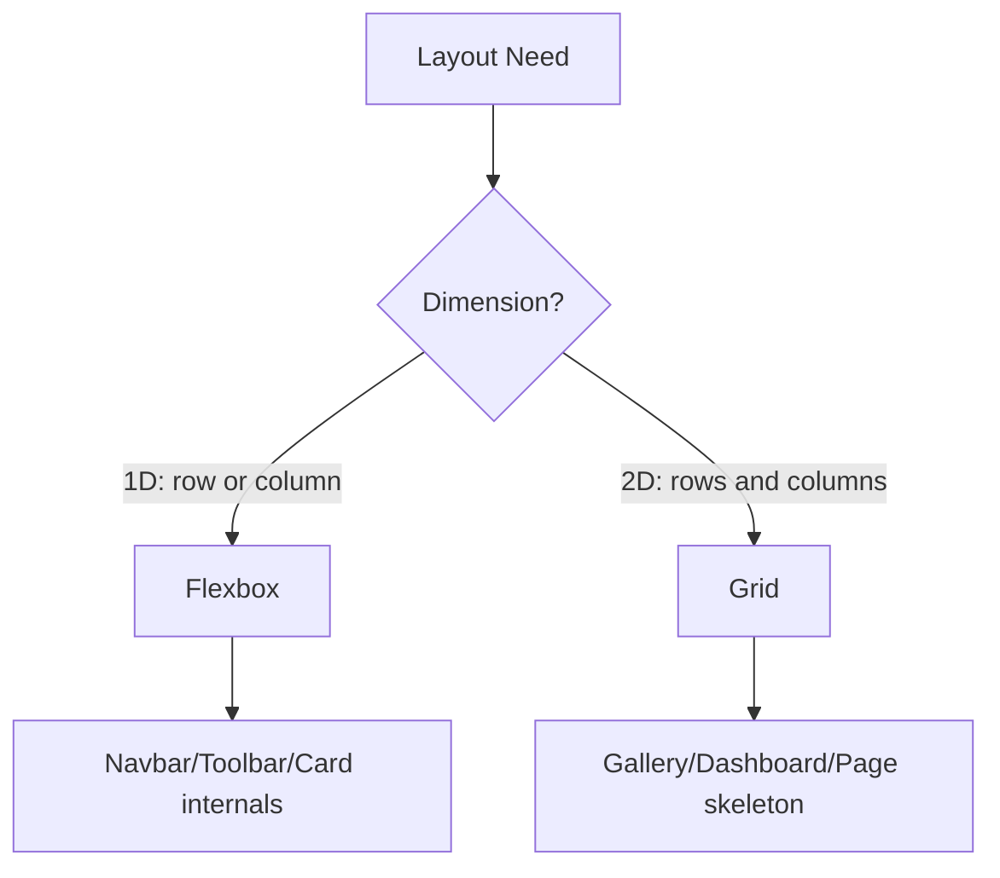
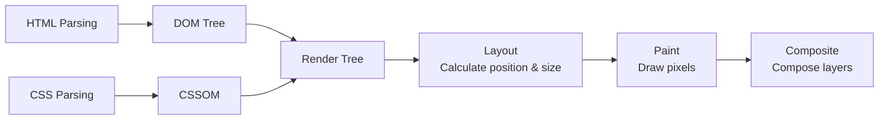

## HTML5 Semantic Tags

HTML5 introduced a set of semantic tags that make document structure self-explanatory. Instead of a screen full of `<div>` elements, you use `<header>`, `<nav>`, `<main>`, `<article>`, `<section>`, `<aside>`, `<footer>`, and other tags to clearly describe content regions.

```html
<header>
  <nav aria-label="Main navigation">
    <a href="/">Home</a>
    <a href="/blog">Blog</a>
  </nav>
</header>
<main>
  <article>
    <h1>Article Title</h1>
    <section>
      <h2>Section One</h2>
      <p>Body content...</p>
    </section>
  </article>
  <aside>
    <h2>Sidebar</h2>
  </aside>
</main>
<footer>Copyright info</footer>
```

Benefits of semantics: **SEO-friendly** (search engines can more easily understand page structure), **accessibility** (screen readers can navigate quickly), **maintainability** (code is documentation). In practice, the criterion is simple—if you can tell the role of a content block just by seeing its tag, that's semantic markup.

## CSS Box Model

Every HTML element occupies a rectangular area on the page, from inside out: **content → padding → border → margin**.



In the **standard box model**, `width` refers only to the content width; the actual rendered width = `width + padding + border`. In the **IE box model** (also called quirks mode), `width` includes content + padding + border. Modern development almost universally uses `border-box`:

```css
*, *::before, *::after {
  box-sizing: border-box;
}
```

### BFC and Stacking Context

A **BFC (Block Formatting Context)** is an independent rendering area where internal elements don't affect the outside. Common ways to trigger a BFC: `overflow: hidden`, `display: flow-root`, `float`, `position: absolute/fixed`.

Practical value of BFC:
- **Clearing floats**: `overflow: hidden` or `display: flow-root` on the parent prevents height collapse caused by floating children
- **Preventing margin collapsing**: Adjacent block elements' top margins collapse; BFC can isolate them
- **Preventing elements from being covered by floats**: Enables two-column adaptive layouts

**Stacking context** determines the Z-axis rendering order of elements. Trigger conditions include: `position` + `z-index`, `opacity < 1`, `transform`, `filter`, `will-change`, etc. Understanding stacking context helps avoid z-index wars.

## Flexbox and Grid Layouts

### Flexbox: One-Dimensional Layout

Flexbox excels at handling single-row or single-column arrangement—distributing and aligning items along the main axis:

```css
.container {
  display: flex;
  justify-content: space-between; /* Main axis distribution */
  align-items: center;            /* Cross axis alignment */
  gap: 16px;                      /* Gap between items */
}
.item {
  flex: 1; /* Equal share of remaining space */
}
```

Typical scenarios: navigation bars (logo left, menu right), text and icon arrangement within cards, form rows (label + input + button).

### Grid: Two-Dimensional Layout

Grid excels at layouts where both rows and columns need to be controlled simultaneously:

```css
.grid {
  display: grid;
  grid-template-columns: repeat(auto-fill, minmax(280px, 1fr));
  gap: 24px;
}
```

Typical scenarios: image galleries, dashboard panels, magazine layouts.



**Selection principle**: Use Flex for one-dimensional, Grid for two-dimensional. In practice, they're often nested—Grid for the page skeleton, Flex for internal component arrangement.

## Selector Specificity and Inheritance

Specificity from highest to lowest:

| Specificity | Source | Example |
|--------|------|------|
| Highest | `!important` | `color: red !important` |
| High | Inline styles | `style="color: red"` |
| Medium | ID selector | `#header { }` — weight (1,0,0) |
| Medium-low | Class/attribute/pseudo-class | `.nav { }` — weight (0,1,0) |
| Low | Element/pseudo-element | `div { }` — weight (0,0,1) |

With equal weight, the later declaration overrides the earlier one. **Inheritance** means certain properties (like `color`, `font-family`) are passed from parent to child elements, but box model properties (`margin`, `padding`, `border`, `width`, `height`) are not inherited.

Practical advice: avoid `!important`, avoid deeply nested selectors (like `.a .b .c .d`), and prefer single class names.

## Responsive Design

### Media Queries

```css
/* Mobile-first */
.container {
  padding: 16px;
}
@media (min-width: 769px) {
  .container {
    padding: 32px;
    max-width: 1280px;
  }
}
```

### Relative Unit System

- **rem**: Based on root element font size, suitable for spacing and fonts. 1rem = 16px (browser default)
- **em**: Based on current element font size, suitable for internal component proportions
- **vw/vh**: Based on viewport dimensions, suitable for full-screen layouts
- **%**: Based on parent element dimensions

```css
html { font-size: 14px; } /* Base */
h1 { font-size: 2rem; }    /* 28px */
.card { padding: 1.5rem; } /* 21px */
.hero { height: 100vh; }   /* Full screen height */
```

### Container Queries (Modern CSS)

```css
.card-container {
  container-type: inline-size;
}
@container (min-width: 400px) {
  .card { flex-direction: row; }
}
```

Container queries let components respond based on their own container size, not the viewport—enabling true component-level responsiveness.

## Rendering Pipeline Overview



Understanding this pipeline is crucial for performance optimization: modifying `width`/`height` triggers Layout reflow (expensive), modifying `color`/`background` only triggers Paint repaint (moderate), and modifying `transform`/`opacity` only triggers Composite compositing (least expensive). Subsequent articles will cover browser rendering principles in depth.
