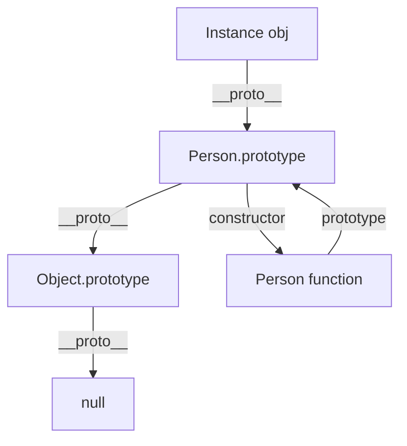

## Execution Context and Call Stack

When the JavaScript engine executes code, it creates an **Execution Context**. Each context contains three parts:

- **Variable Environment**: Stores `var` declarations and function declarations
- **Lexical Environment**: Stores `let`/`const` declarations
- **this binding**: Determined by how the function is called

The execution context lifecycle: creation → execution → cleanup. The call stack manages the entry and exit of contexts:

```javascript
function greet(name) {
  return `Hello, ${name}`;
}
function start() {
  const msg = greet("World");
  console.log(msg);
}
start();
// Call stack changes: start() → greet() → return → console.log() → return
```

The call stack is a Last-In-First-Out (LIFO) structure. When the call stack becomes too deep, it throws **RangeError: Maximum call stack size exceeded**—a stack overflow. The typical scenario is recursion without a termination condition.

## Closures, Scope Chain, and Hoisting

### Scope Chain

JavaScript uses **Lexical Scope**—a function's scope is determined at definition time, not at call time. The engine looks up variables through the scope chain: starting from the current scope, searching outward layer by layer until reaching the global scope.

### Closures

A closure is when a function can access variables in its lexical scope, even when the function is executed outside that scope:

```javascript
function createCounter() {
  let count = 0; // Captured by closure
  return {
    increment: () => ++count,
    getCount: () => count,
  };
}
const counter = createCounter();
counter.increment(); // 1
counter.increment(); // 2
counter.getCount();  // 2
```

Practical value of closures: **Data privacy** (module pattern), **function factories** (currying), **callbacks with state** (event handlers). Note that closures prevent garbage collection—improper use can cause memory leaks.

### Variable Hoisting

```javascript
console.log(a); // undefined (var is hoisted, assignment is not)
console.log(b); // ReferenceError (let Temporal Dead Zone TDZ)
var a = 1;
let b = 2;
```

`var` declarations are hoisted to the top of the scope and initialized to `undefined`; `let`/`const` declarations are also hoisted, but are in a **Temporal Dead Zone (TDZ)** before the declaration statement—accessing them throws an error. Function declarations are hoisted entirely (including the function body), while function expressions only hoist the variable declaration.

## Prototype Chain and Inheritance

JavaScript's inheritance is based on the prototype chain, not classes. Every object has an internal `[[Prototype]]` property pointing to its prototype object.



Property lookup searches up the prototype chain: `obj.name` → `obj.__proto__.name` → `obj.__proto__.__proto__.name` → ... → `null`.

### Evolution of Inheritance Patterns

```javascript
// 1. Prototype chain inheritance
Child.prototype = new Parent();

// 2. Constructor stealing
function Child() {
  Parent.call(this);
}

// 3. Combination inheritance (most common ES5 pattern)
function Child() {
  Parent.call(this);           // Instance properties
}
Child.prototype = Object.create(Parent.prototype); // Prototype methods
Child.prototype.constructor = Child;

// 4. ES6 class syntactic sugar
class Child extends Parent {
  constructor() {
    super();
  }
}
```

`class` is essentially syntactic sugar over the prototype chain, but the syntax is cleaner and closer to the conventions of other languages.

## ES6+ Core Features

### Destructuring Assignment

```javascript
// Array destructuring
const [first, , third] = [1, 2, 3];

// Object destructuring + renaming + defaults
const { name: userName = "Anonymous", age } = user;

// Function parameter destructuring
function render({ title, items = [] }) {
  // ...
}
```

### Arrow Functions

Arrow functions don't have their own `this`, `arguments`, or `super`—they inherit `this` from the outer lexical scope:

```javascript
const team = {
  members: ["Alice", "Bob"],
  list() {
    // Arrow function inherits this, pointing to team
    this.members.forEach(member => console.log(member, this.members));
  },
};
```

### Symbol and Iterator

```javascript
// Symbol — unique identifier
const id = Symbol("id");
const user = { [id]: 123, name: "Alice" };

// Iterator — unified traversal interface
const range = {
  from: 1,
  to: 5,
  [Symbol.iterator]() {
    let current = this.from;
    return {
      next: () => current <= this.to
        ? { value: current++, done: false }
        : { done: true },
    };
  },
};
[...range]; // [1, 2, 3, 4, 5]
```

Objects that implement the `Symbol.iterator` protocol can be traversed with `for...of` and the spread operator.

## Module System Evolution


| Standard | Loading | Use Case | Characteristics |
|------|----------|----------|------|
| IIFE | Synchronous | Early browsers | Global pollution isolation, no dependency management |
| CommonJS | Synchronous | Node.js | Runtime loading, value copying |
| AMD | Asynchronous | Early browsers | RequireJS, verbose syntax |
| ES Modules | Static | Browser + Node | Compile-time static analysis, value references, Tree-shaking friendly |

```javascript
// ES Modules — modern standard
export const API_BASE = "/api";
export function fetchUser(id) { /* ... */ }
export default class UserService { /* ... */ }

// Importing
import UserService, { API_BASE } from "./user.js";
```

The static nature of ES Modules allows build tools to analyze the dependency graph at compile time and implement Tree-shaking—removing unused code. This is the foundation of modern build tools like Vite and Rollup.
