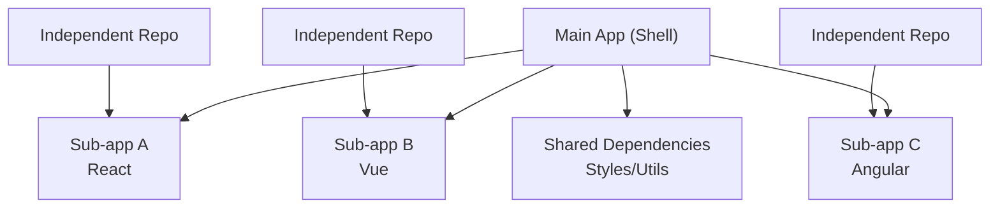
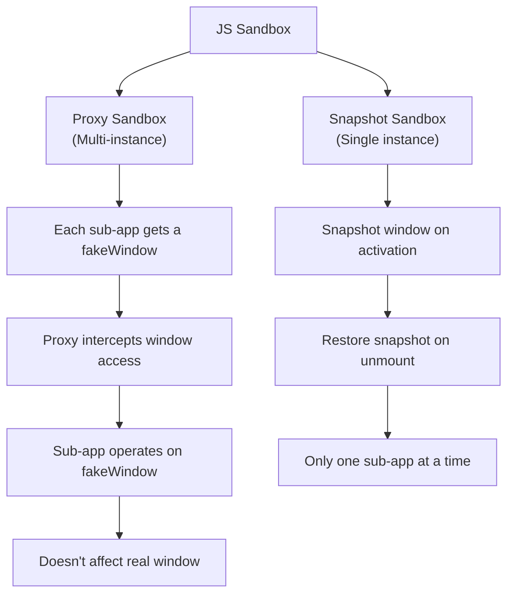

## Micro-Frontend Core Concepts

Micro-frontends borrow the idea of backend microservices: splitting a large frontend application into multiple small, independent, self-governing sub-applications, each independently developed, deployed, and run.

**Suitable scenarios**:
- Large products with multi-team collaboration (e.g., ERP, SaaS platforms)
- Progressive technology stack migration (gradually replacing old jQuery with React)
- Different modules have inconsistent release cadences

**Unsuitable scenarios**: Small projects, single team, unified tech stack—don't adopt micro-frontends just for the sake of it.



## Integration Solution Comparison

| Solution | Isolation | Integration | Tech Stack Constraints | Performance | Complexity |
|------|--------|--------|------------|------|--------|
| iframe | Perfect | Low | None | Poor (extra process) | Low |
| Web Components | Style isolation | Medium | None | Good | Medium |
| Module Federation | Shared runtime | High | None | Good | Medium |
| qiankun | JS+Style isolation | High | None | Good | High |

### iframe Approach

```html
<iframe
  src="https://sub-app.example.com"
  style="width: 100%; height: 100%; border: none;"
></iframe>
```

Pros: Natural isolation, simplest. Cons: Poor performance (each iframe has its own process), URL not synced, popups can't overflow, limited communication.

### Web Components

```javascript
class MicroApp extends HTMLElement {
  connectedCallback() {
    const shadow = this.attachShadow({ mode: "open" });
    shadow.innerHTML = `
      <style>
        :host { display: block; } /* Style isolation */
      </style>
      <div id="app"></div>
    `;
    // Mount sub-app in shadow DOM
    mountSubApp(shadow.querySelector("#app"));
  }
  disconnectedCallback() {
    unmountSubApp();
  }
}
customElements.define("micro-app", MicroApp);
```

Pros: Native browser support, Shadow DOM style isolation. Cons: JS not isolated, ecosystem less mature than mainstream frameworks, difficult debugging.

### Module Federation

```javascript
// Main app webpack.config.js
new ModuleFederationPlugin({
  name: "host",
  remotes: {
    dashboard: "dashboard@https://dashboard.example.com/remoteEntry.js",
    settings: "settings@https://settings.example.com/remoteEntry.js",
  },
  shared: {
    react: { singleton: true, requiredVersion: "^18" },
    "react-dom": { singleton: true, requiredVersion: "^18" },
  },
});

// Sub-app dashboard/webpack.config.js
new ModuleFederationPlugin({
  name: "dashboard",
  filename: "remoteEntry.js",
  exposes: {
    "./App": "./src/App",
  },
  shared: { react: { singleton: true }, "react-dom": { singleton: true } },
});
```

```jsx
// Using in main app
const DashboardApp = React.lazy(() => import("dashboard/App"));

function App() {
  return (
    <Suspense fallback="Loading...">
      <DashboardApp />
    </Suspense>
  );
}
```

Pros: Runtime integration, shared dependencies, true on-demand loading. Cons: Shared version conflict risk, complex build configuration.

### qiankun

qiankun wraps single-spa, providing out-of-the-box JS sandbox and style isolation:

```javascript
// Main app
import { registerMicroApps, start } from "qiankun";

registerMicroApps([
  {
    name: "dashboard",
    entry: "//dashboard.example.com",
    container: "#subapp-container",
    activeRule: "/dashboard",
  },
  {
    name: "settings",
    entry: "//settings.example.com",
    container: "#subapp-container",
    activeRule: "/settings",
  },
]);

start({ prefetch: "all", sandbox: { strictStyleIsolation: true } });
```

```javascript
// Sub-app exports lifecycle hooks
export async function bootstrap() { /* Initialize */ }
export async function mount(props) {
  ReactDOM.render(<App />, props.container.querySelector("#root"));
}
export async function unmount(props) {
  ReactDOM.unmountComponentAtNode(props.container.querySelector("#root"));
}
```

## JS Sandbox Isolation

qiankun provides two types of JS sandboxes:



**Proxy Sandbox**: Creates a `fakeWindow` for each sub-app, intercepting `window` read/write operations via Proxy. Multi-instance safe, slightly better performance.

**Snapshot Sandbox**: Records a `window` snapshot when activating a sub-app, restores it on unmount. Better compatibility (for environments without Proxy), but only supports single-instance operation.

## Style Isolation

| Strategy | Implementation | Effect |
|------|----------|------|
| StrictStyleIsolation | Shadow DOM | Complete isolation, but styles for body-mounted elements like popups fail |
| ExperimentalStyleIsolation | Runtime scoped prefix | Basic isolation, dynamically inserted styles may leak |
| CSS Modules / Scoped CSS | Compile-time processing | Recommended, framework-level isolation |
| CSS Naming Convention | BEM etc. | Simple but relies on team discipline |

**Recommended approach**: Main app and sub-apps use different CSS prefixes; sub-apps internally use CSS Modules or Scoped CSS. Shadow DOM has compatibility issues with popups, dropdown menus, and similar scenarios.

## Micro-Frontend Governance

### Shared Dependency Management

```javascript
// externals approach — CDN loads shared libraries
// webpack.config.js
module.exports = {
  externals: {
    react: "React",
    "react-dom": "ReactDOM",
  },
};

// Unified in HTML
<script src="https://cdn.example.com/react/18/react.production.min.js"></script>
<script src="https://cdn.example.com/react/18/react-dom.production.min.js"></script>
```

### Sub-app Communication

```javascript
// Simple approach: CustomEvent
window.dispatchEvent(new CustomEvent("user-login", { detail: { userId: 1 } }));
window.addEventListener("user-login", (e) => console.log(e.detail));

// Medium approach: shared state (initGlobalState)
import { initGlobalState } from "qiankun";
const { onGlobalStateChange, setGlobalState } = initGlobalState({
  user: null,
});
onGlobalStateChange((state) => { /* Global state change */ });
setGlobalState({ user: { name: "Alice" } });

// Complex approach: micro-frontend message bus + local storage
```

### Version and Deployment Governance

- Each sub-app has independent CI/CD and version numbers
- Main app configures sub-app version mapping table, supports canary releases
- Sub-app entry provides version info endpoint, main app performs compatibility checks
- Rollback strategy: automatically degrade to previous version when sub-app is unhealthy
