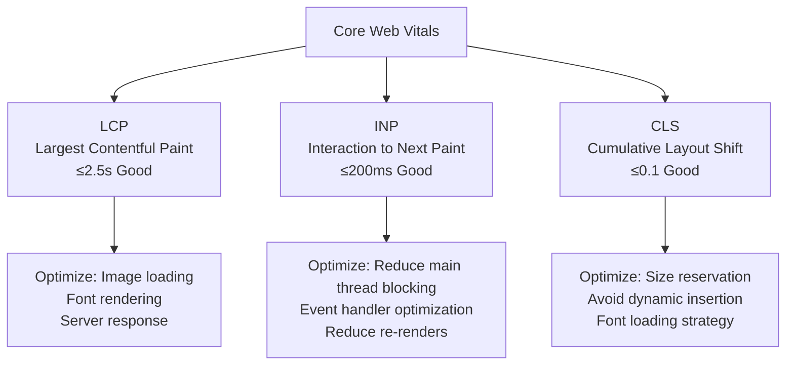
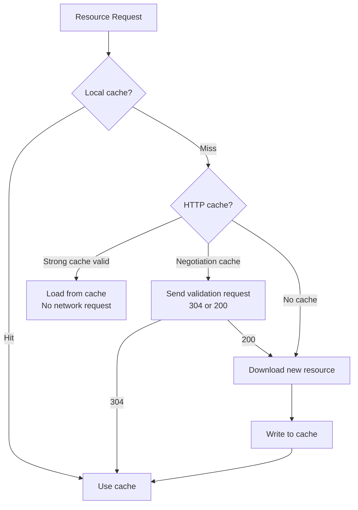

## Core Web Vitals Metrics

Core Web Vitals are three key user experience metrics defined by Google:



| Metric | Meaning | Good Threshold | Measurement Tool |
|------|------|----------|----------|
| LCP | Render time of the largest content element in the viewport | ≤2.5s | Lighthouse, Web Vitals |
| INP | Latency from user interaction to next paint | ≤200ms | Chrome UX Report |
| CLS | Cumulative score of unexpected layout shifts during page lifecycle | ≤0.1 | Lighthouse, Web Vitals |

### Measurement Methods

```javascript
// Real user measurement using web-vitals library
import { onLCP, onINP, onCLS } from "web-vitals";

onLCP((metric) => reportToAnalytics("LCP", metric));
onINP((metric) => reportToAnalytics("INP", metric));
onCLS((metric) => reportToAnalytics("CLS", metric));
```

**Lab data** (Lighthouse) vs **Real user data** (RUM): Lab data is controllable and repeatable; real data reflects actual experience. Combining both gives a complete performance picture.

## Resource Optimization

### Code Splitting

```javascript
// Route-level lazy loading
const Dashboard = React.lazy(() => import("./pages/Dashboard"));
const Settings = React.lazy(() => import("./pages/Settings"));

function App() {
  return (
    <Suspense fallback={<Loading />}>
      <Routes>
        <Route path="/dashboard" element={<Dashboard />} />
        <Route path="/settings" element={<Settings />} />
      </Routes>
    </Suspense>
  );
}

// Vite dynamic imports auto code-split
// import("./heavy-module") → generates independent chunk
```

### Image Optimization

```html
<!-- Responsive images: load different sizes based on viewport -->


<!-- Modern format + fallback -->
<picture>
  <source srcset="photo.avif" type="image/avif" />
  <source srcset="photo.webp" type="image/webp" />
  
</picture>
```

Format comparison: AVIF (smallest, ~50% vs JPEG) > WebP (~30% vs JPEG) > JPEG/PNG.

### Font Loading

```css
@font-face {
  font-family: "MyFont";
  src: url("/fonts/myfont.woff2") format("woff2");
  font-display: swap; /* Use system font first, swap when loaded */
}

/* Preload critical font */
/* <link rel="preload" href="/fonts/myfont.woff2" as="font" crossorigin /> */
```

`font-display: swap` avoids FOIT (Flash of Invisible Text) but causes FOUT (Flash of Unstyled Text). Using `size-adjust` can reduce layout shift when fonts switch.

## Runtime Optimization

### Virtual Lists

When list items exceed hundreds, too many DOM nodes cause rendering jank. Virtual lists only render items within the visible area:


```jsx
import { useVirtualizer } from "@tanstack/react-virtual";

function LargeList({ items }) {
  const parentRef = useRef();
  const virtualizer = useVirtualizer({
    count: items.length,
    getScrollElement: () => parentRef.current,
    estimateSize: () => 50, // Height per item
  });

  return (
    <div ref={parentRef} style={{ height: "600px", overflow: "auto" }}>
      <div style={{ height: virtualizer.getTotalSize() }}>
        {virtualizer.getVirtualItems().map((item) => (
          <div
            key={item.index}
            style={{
              position: "absolute",
              top: item.start,
              height: item.size,
            }}
          >
            {items[item.index].name}
          </div>
        ))}
      </div>
    </div>
  );
}
```


### Web Workers

Move CPU-intensive tasks to Worker threads to avoid blocking the main thread:

```javascript
// main.js
const worker = new Worker("./sort-worker.js");
worker.postMessage({ data: largeArray });
worker.onmessage = (e) => {
  renderSortedData(e.data);
};

// sort-worker.js
self.onmessage = (e) => {
  const sorted = heavySort(e.data.data);
  self.postMessage(sorted);
};
```

### requestIdleCallback

Execute low-priority tasks when the browser is idle:

```javascript
function processAnalytics(queue) {
  if (queue.length === 0) return;
  requestIdleCallback((deadline) => {
    while (deadline.timeRemaining() > 0 && queue.length > 0) {
      sendAnalytics(queue.shift());
    }
    processAnalytics(queue); // Not finished, continue next idle period
  });
}
```

## Caching Strategy



### HTTP Caching

```nginx
# Nginx configuration
# Immutable resources (with hash) — strong cache 1 year
location /assets/ {
  expires 1y;
  add_header Cache-Control "public, immutable";
}

# HTML — negotiation cache
location / {
  add_header Cache-Control "no-cache";
}
```

### Service Worker

```javascript
// sw.js — Cache-first strategy
self.addEventListener("fetch", (event) => {
  event.respondWith(
    caches.match(event.request).then((cached) => {
      return cached || fetch(event.request).then((response) => {
        const clone = response.clone();
        caches.open("v1").then((cache) => cache.put(event.request, clone));
        return response;
      });
    })
  );
});
```

Workbox provides a more complete caching strategy library: CacheFirst, NetworkFirst, StaleWhileRevalidate, etc.

## Performance Monitoring

```javascript
// Monitor long tasks using PerformanceObserver
const observer = new PerformanceObserver((list) => {
  for (const entry of list.getEntries()) {
    if (entry.duration > 50) {
      reportLongTask({
        duration: entry.duration,
        name: entry.name,
        startTime: entry.startTime,
      });
    }
  }
});
observer.observe({ type: "longtask", buffered: true });

// Resource loading monitoring
const resourceObserver = new PerformanceObserver((list) => {
  for (const entry of list.getEntries()) {
    if (entry.transferSize > 100 * 1024) {
      reportLargeResource({
        name: entry.name,
        size: entry.transferSize,
        duration: entry.duration,
      });
    }
  }
});
resourceObserver.observe({ type: "resource", buffered: true });
```

The core approach to performance optimization: **Measure → Analyze → Optimize → Verify**. Optimization without data support is blind optimization.
