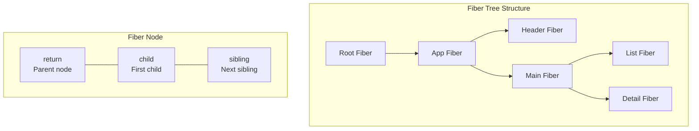
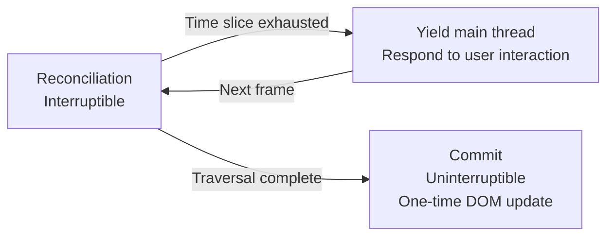
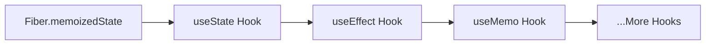

## JSX Compilation and Virtual DOM

JSX is not template syntax—it's syntactic sugar for `React.createElement()`:

```jsx
// JSX syntax
const element = <h1 className="title">Hello</h1>;

// Compiled result
const element = React.createElement("h1", { className: "title" }, "Hello");

// Structure returned by createElement
{
  type: "h1",
  props: { className: "title", children: "Hello" }
}
```

**Virtual DOM** is a lightweight JS object representation of the real DOM. React compares the differences between two Virtual DOM trees (Reconciliation), calculates the minimal update operations, and batch-applies them to the real DOM.

### Three Diff Strategies

1. **Tree Diff**: Only compares nodes at the same level, no cross-level comparison—O(n) complexity
2. **Component Diff**: Same type components continue comparing subtrees, different types are replaced directly
3. **Element Diff**: Same-level sibling nodes identified by `key`, enabling efficient reordering

## Fiber Architecture

React 16 rewrote the core algorithm, introducing the Fiber architecture—breaking rendering work into small units, supporting **interruptible rendering**.



Each Fiber node is a unit of work, containing:
- **Static structure**: type, key, props
- **Tree traversal pointers**: child (first child), sibling (next sibling), return (parent)
- **Side effects**: effectTag (add/delete/update), nextEffect (effect linked list)

### Time Slicing

Fiber's workflow: execute Fiber node processing during each frame's idle time (`requestIdleCallback` / `MessageChannel`). If time runs out before processing completes, pause and yield the main thread, continuing in the next frame. This is **interruptible rendering**—it won't block user interactions for long periods.



## Hooks Implementation Principles

The core of Hooks is a **linked list**, stored on the Fiber node's `memoizedState` property:



During each render, Hooks take out states from the linked list in call order. **This is why Hooks cannot be used inside conditional statements**—order changes would cause state misalignment.

```javascript
// Wrong: Hook inside condition
if (condition) {
  const [value, setValue] = useState(0); // Unstable order
}

// Correct: Call Hook at top level
const [value, setValue] = useState(0);
if (condition) {
  // Use value
}
```

### Common Hooks Principles

- **useState**: Closure + linked list node. `setState` enqueues new value, retrieves latest value from linked list during re-render
- **useEffect**: Executes callback after render completes, chains via `nextEffect` linked list, runs cleanup function on unmount
- **useMemo/useCallback**: Compares dependency arrays, reuses cached value if dependencies unchanged
- **useRef**: Persists a mutable reference on the Fiber node, maintained across render cycles

## State Management Evolution

| Solution | Use Case | Characteristics |
|------|----------|------|
| useState/useReducer | Within component | Lightweight, don't add libraries if sufficient |
| Context | Cross-component sharing | Avoids prop drilling, but not suitable for high-frequency updates |
| Redux | Large applications | Single Store, pure function Reducers, middleware ecosystem |
| Zustand | Medium-large applications | Minimal API, no Provider needed, subscription-based |
| Jotai | Atomic state | Fine-grained updates, automatic dependency tracking |

```javascript
// Zustand — minimal state management
import { create } from "zustand";

const useStore = create((set) => ({
  user: null,
  login: (user) => set({ user }),
  logout: () => set({ user: null }),
}));

// Any component uses it directly, no Provider needed
function Avatar() {
  const user = useStore((s) => s.user);
  return ;
}
```

## React 18+ Concurrent Features

### useTransition

Marks state updates as "low priority", not blocking user input:

```jsx
function SearchPage() {
  const [query, setQuery] = useState("");
  const [results, setResults] = useState([]);
  const [isPending, startTransition] = useTransition();

  function handleChange(e) {
    setQuery(e.target.value); // High priority: update input immediately
    startTransition(() => {
      setResults(search(e.target.value)); // Low priority: interruptible search
    });
  }

  return (
    <>
      <input value={query} onChange={handleChange} />
      {isPending && <Spinner />}
      <ResultsList items={results} />
    </>
  );
}
```

### Suspense

Declaratively wait for async data loading:

```jsx
<Suspense fallback={<Loading />}>
  <UserProfile /> {/* Internally throws Promise to trigger Suspense */}
</Suspense>
```

React 18's Suspense with Concurrent Rendering enables **Selective Hydration**—prioritizing hydration of regions the user is interacting with, deferring hydration of other regions.

## 6. React 19 New Features

### 6.1 React Compiler

React Compiler (formerly React Forget) is an automatic optimization compiler developed by Meta, eliminating the need for manual useMemo/useCallback:

- **Auto-memoization**: The compiler analyzes component dependencies and automatically inserts memoization logic
- **Zero intrusion**: Existing code requires no modifications, optimization at compile time
- **Developer experience**: No longer need to think about "should I memo this?"

### 6.2 Server Actions

```jsx
// Server Actions — define directly in components
async function CreatePost() {
  async function createAction(formData) {
    'use server';
    const title = formData.get('title');
    await db.posts.create({ title });
    revalidatePath('/posts');
  }

  return (
    <form action={createAction}>
      <input name="title" />
      <button type="submit">Create</button>
    </form>
  );
}
```

### 6.3 use() Hook

```jsx
// Read Promises and Context at render time
function Post({ postPromise }) {
  const post = use(postPromise);
  return <h1>{post.title}</h1>;
}
```

## 7. Performance Optimization Practices

### 7.1 React.memo and Render Optimization

```jsx
// Precisely control component re-renders
const ExpensiveList = React.memo(function ExpensiveList({ items, onSelect }) {
  return items.map(item => (
    <Item key={item.id} item={item} onSelect={onSelect} />
  ));
}, (prev, next) => {
  return prev.items.length === next.items.length;
});
```

### 7.2 Code Splitting and Lazy Loading

```jsx
const HeavyComponent = React.lazy(() => import('./HeavyComponent'));

function App() {
  return (
    <Suspense fallback={<Skeleton />}>
      <HeavyComponent />
    </Suspense>
  );
}
```

### 7.3 Virtual Lists

For long list rendering (1000+ items), use react-window or @tanstack/virtual:


```jsx
import { useVirtualizer } from '@tanstack/react-virtual';

function VirtualList({ items }) {
  const parentRef = useRef(null);

  const virtualizer = useVirtualizer({
    count: items.length,
    getScrollElement: () => parentRef.current,
    estimateSize: () => 50,
  });

  return (
    <div ref={parentRef} style={{ height: '600px', overflow: 'auto' }}>
      <div style={{ height: virtualizer.getTotalSize() }}>
        {virtualizer.getVirtualItems().map(virtualRow => (
          <div key={virtualRow.key} style={{
            position: 'absolute',
            top: 0,
            transform: `translateY(${virtualRow.start}px)`,
            height: virtualRow.size,
          }}>
            {items[virtualRow.index].name}
          </div>
        ))}
      </div>
    </div>
  );
}
```


## 8. Error Boundaries

```jsx
class ErrorBoundary extends React.Component {
  constructor(props) {
    super(props);
    this.state = { hasError: false, error: null };
  }

  static getDerivedStateFromError(error) {
    return { hasError: true, error };
  }

  componentDidCatch(error, errorInfo) {
    console.error('Error caught by boundary:', error, errorInfo);
  }

  render() {
    if (this.state.hasError) {
      return this.props.fallback || <h1>Something went wrong.</h1>;
    }
    return this.props.children;
  }
}

// Usage
<ErrorBoundary fallback={<ErrorPage />}>
  <App />
</ErrorBoundary>
```
