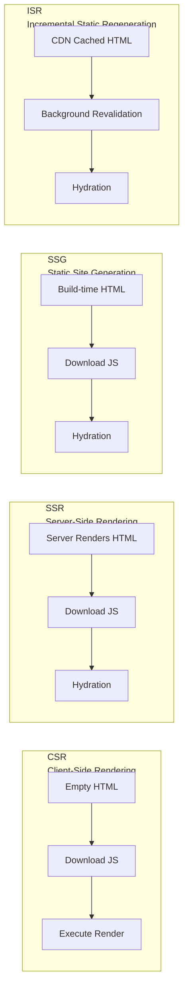
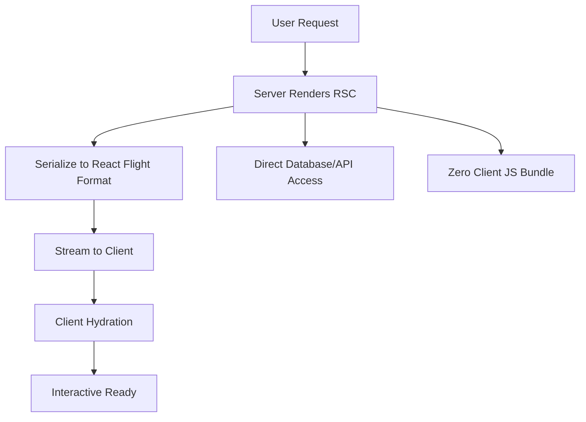
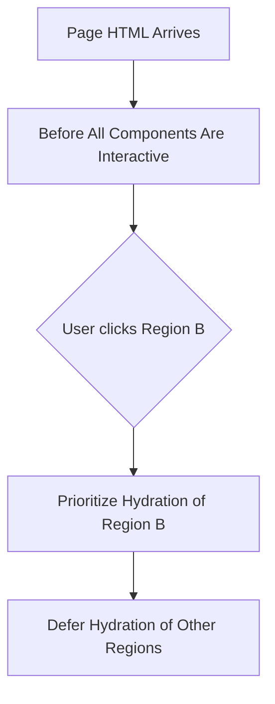

## Rendering Mode Comparison



| Mode | Render Timing | FCP | TTI | SEO | Dynamic Content | Use Case |
|------|----------|-----|-----|-----|----------|----------|
| CSR | Browser | Slow | Slow | Poor | Real-time | Admin panels, tools |
| SSR | On request | Fast | Medium | Good | Supported | E-commerce, news |
| SSG | At build time | Fastest | Fast | Good | Not supported | Blogs, docs |
| ISR | Build + periodic update | Fastest | Fast | Good | Near real-time | Product pages, blogs |

**Key difference**: SSR renders on every request (high server load), SSG generates once at build time (content updates require rebuild), ISR is SSG + background periodic updates (balancing performance and timeliness).

## Next.js App Router and RSC

### React Server Components (RSC)

RSC allows components to execute on the server, directly accessing databases and file systems, with results streamed to the client in serialized format:

```tsx
// Server Component — default, mark async to directly await
async function UserProfile({ userId }: { userId: string }) {
  const user = await db.user.findUnique({ where: { id: userId } });
  // This component is not sent to the client, only the render result is
  return (
    <div>
      <h1>{user.name}</h1>
      <p>{user.bio}</p>
    </div>
  );
}

// Client Component — explicitly mark when interactivity is needed
"use client";
function LikeButton({ postId }: { postId: string }) {
  const [liked, setLiked] = useState(false);
  return <button onClick={() => setLiked(!liked)}>❤️</button>;
}
```



RSC's core value: **Zero client JS**—server component code doesn't enter the client bundle. Extensive data fetching and formatting logic stays on the server; the client only receives the rendered result.

### App Router Data Fetching

```tsx
// app/posts/page.tsx — Server Component by default
async function PostsPage() {
  const posts = await fetch("https://api.example.com/posts", {
    next: { revalidate: 3600 }, // ISR: revalidate every hour
  });

  return (
    <main>
      {posts.map((post) => (
        <article key={post.id}>
          <h2>{post.title}</h2>
          <LikeButton postId={post.id} /> {/* Client Component */}
        </article>
      ))}
    </main>
  );
}
```

## Nuxt 3 SSR

### Server-Side Rendering and Hydration

Nuxt 3's SSR flow:

1. **Server**: Executes Vue components to render HTML string, sends to browser
2. **Client**: Browser displays HTML (user can see content immediately), downloads JS simultaneously
3. **Hydration**: Vue "activates" static HTML on the client, binding events and restoring reactivity

```typescript
// server/api/user.ts — Nuxt 3 server API
export default defineEventHandler(async (event) => {
  const id = getRouterParam(event, "id");
  const user = await prisma.user.findUnique({ where: { id } });
  return user;
});

// pages/user/[id].vue — Automatic SSR
const route = useRoute();
const { data: user } = await useFetch(`/api/user/${route.params.id}`);
```

### Hydration Caveats

Hydration mismatch is the most common SSR problem—server-rendered HTML is inconsistent with the DOM after client hydration:


```vue
<!-- Dangerous: server and client time differ -->
<template>
  <p>{{ new Date().toLocaleString() }}</p>
</template>

<!-- Safe: show dynamic content only after client mount -->
<template>
  <p v-if="mounted">{{ currentTime }}</p>
  <p v-else>Loading...</p>
</template>
```


Common causes: using `Date`/`Math.random()`, depending on browser APIs (`window`, `document`), inconsistent SSR behavior in third-party components.

## Streaming Rendering and Selective Hydration

### Streaming SSR

Traditional SSR must wait for all data fetching to complete before sending HTML. Streaming rendering allows sending in chunks:

```tsx
// Next.js App Router supports streaming rendering by default
export default function Page() {
  return (
    <main>
      <Header />           {/* Render immediately */}
      <Suspense fallback={<Skeleton />}>
        <SlowDataSection /> {/* Streamed when data is ready */}
      </Suspense>
      <Footer />           {/* Render immediately */}
    </main>
  );
}
```

Users see Header + Footer + Skeleton first, and SlowDataSection is automatically replaced when its data is ready—no need to wait for all data.

### Selective Hydration

React 18's concurrent features enable **selective hydration**: prioritizing hydration of regions the user is interacting with.



This means lower-priority modules in the page don't block user interactions. Combined with `useTransition`, you can further mark hydration priority.

## SSR Performance Considerations

- **First-screen TTFB**: SSR increases server response time; server-side caching (Redis, CDN) is needed to mitigate
- **Hydration Volume**: More JS means slower hydration; RSC can significantly reduce client JS
- **Server Memory**: Each request creates Vue/React instances; watch for memory leaks under high concurrency
- **Caching Strategy**: Static pages use CDN edge caching, dynamic pages use Redis to cache rendered results

```nginx
# Nginx SSR cache configuration
proxy_cache_path /var/cache/ssr levels=1:2 keys_zone=ssr:10m;

location / {
  proxy_cache ssr;
  proxy_cache_valid 200 10m;
  proxy_pass http://ssr_server;
  add_header X-Cache-Status $upstream_cache_status;
}
```
