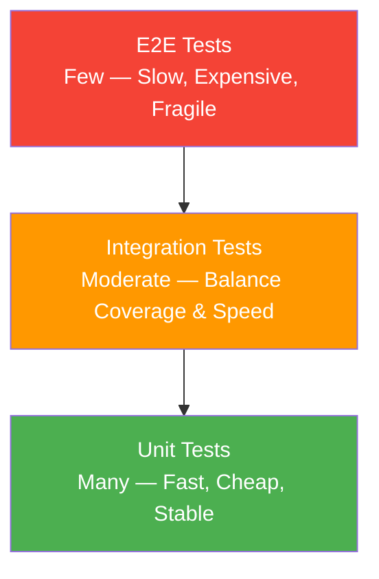
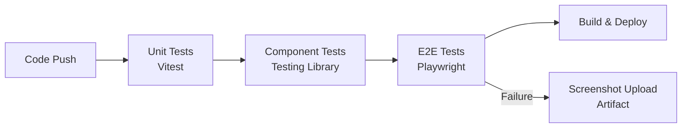

## Testing Pyramid



| Level | Quantity | Speed | Coverage | Maintenance Cost |
|------|------|------|----------|----------|
| Unit Tests | Many | Milliseconds | Functions/Modules | Low |
| Integration Tests | Moderate | Seconds | Component interactions | Medium |
| E2E Tests | Few | Seconds to Minutes | User flows | High |

**Core principle**: Bottom-level unit tests should be many and fast; top-level E2E tests should be few and stable. An inverted pyramid (many E2E, few unit tests) leads to slow and fragile CI.

## Vitest/Jest Unit Testing

Vitest is Vite's native testing framework, compatible with Jest API but faster:

```typescript
// math.ts
export function add(a: number, b: number) { return a + b; }
export function divide(a: number, b: number) {
  if (b === 0) throw new Error("Divisor cannot be zero");
  return a / b;
}

// math.test.ts
import { describe, it, expect } from "vitest";
import { add, divide } from "./math";

describe("add", () => {
  it("adds two numbers", () => {
    expect(add(1, 2)).toBe(3);
  });

  it("handles negative numbers", () => {
    expect(add(-1, 1)).toBe(0);
  });
});

describe("divide", () => {
  it("divides normally", () => {
    expect(divide(6, 3)).toBe(2);
  });

  it("throws on division by zero", () => {
    expect(() => divide(1, 0)).toThrow("Divisor cannot be zero");
  });
});
```

### Mock and Spy

```typescript
import { vi } from "vitest";

// Mock entire module
vi.mock("./api", () => ({
  fetchUser: vi.fn(() => Promise.resolve({ name: "Alice" })),
}));

// Spy tracks calls
const callback = vi.fn();
button.click();
expect(callback).toHaveBeenCalledTimes(1);

// Fake timers
vi.useFakeTimers();
setTimeout(callback, 1000);
vi.advanceTimersByTime(1000);
expect(callback).toHaveBeenCalled();
```

## Testing Library Component Testing

Testing Library's philosophy: **test components the way users interact with them**—find elements by text, role, and label, rather than testing implementation details.

```jsx
// UserList.jsx
function UserList({ users }) {
  return (
    <ul>
      {users.map((user) => (
        <li key={user.id}>{user.name}</li>
      ))}
    </ul>
  );
}

// UserList.test.jsx
import { render, screen } from "@testing-library/react";
import UserList from "./UserList";

it("renders user list", () => {
  const users = [
    { id: 1, name: "Alice" },
    { id: 2, name: "Bob" },
  ];
  render(<UserList users={users} />);
  expect(screen.getByText("Alice")).toBeInTheDocument();
  expect(screen.getByText("Bob")).toBeInTheDocument();
});
```

### Query Priority

1. **getByRole** — Best, simulates screen readers
2. **getByLabelText** — Form fields
3. **getByText** — Buttons and links
4. **getByTestId** — Last resort, when semantic queries aren't possible

```jsx
// Recommended
screen.getByRole("button", { name: "Submit" });
screen.getByLabelText("Username");

// Not recommended — testing implementation details
container.querySelector(".submit-btn");
```

### User Interaction Testing

```jsx
import { render, screen, fireEvent } from "@testing-library/react";
import userEvent from "@testing-library/user-event";

it("form submission", async () => {
  const user = userEvent.setup();
  const onSubmit = vi.fn();
  render(<LoginForm onSubmit={onSubmit} />);

  await user.type(screen.getByLabelText("Username"), "alice");
  await user.type(screen.getByLabelText("Password"), "secret");
  await user.click(screen.getByRole("button", { name: "Login" }));

  expect(onSubmit).toHaveBeenCalledWith({
    username: "alice",
    password: "secret",
  });
});
```

`userEvent` is more realistic than `fireEvent`—it simulates the complete user interaction chain (focus, input, blur).

## E2E Testing and CI Integration

### Playwright

```typescript
// e2e/login.spec.ts
import { test, expect } from "@playwright/test";

test("user login flow", async ({ page }) => {
  await page.goto("/login");

  await page.fill('[data-testid="username"]', "alice");
  await page.fill('[data-testid="password"]', "secret");
  await page.click('button:has-text("Login")');

  await expect(page).toHaveURL("/dashboard");
  await expect(page.locator(".welcome")).toContainText("Welcome, Alice");
});
```

Playwright advantages: cross-browser (Chromium/Firefox/WebKit), auto-waiting, network interception, screenshot comparison.

### CI Integration

```yaml
# .github/workflows/test.yml
name: Test
on: [push, pull_request]
jobs:
  test:
    runs-on: ubuntu-latest
    steps:
      - uses: actions/checkout@v4
      - uses: actions/setup-node@v4
        with: { node-version: 20 }
      - run: npm ci
      - run: npm run test:unit
      - run: npm run test:e2e
      - uses: actions/upload-artifact@v4
        if: failure()
        with:
          name: playwright-report
          path: playwright-report/
```



## Visual Regression Testing

Visual regression testing discovers unexpected UI changes through screenshot comparison:

```bash
# Playwright visual comparison
npx playwright test --update-snapshots  # Update baseline screenshots
```

```typescript
test("button style unchanged", async ({ page }) => {
  await page.goto("/components/button");
  await expect(page.locator(".button")).toHaveScreenshot("button.png", {
    maxDiffPixelRatio: 0.01, // Allow 1% pixel difference
  });
});
```

**Chromatic** (by the Storybook team) provides cloud-based visual regression service: automatic screenshot comparison for each PR, flagging visual changes in the Review.

Visual regression testing is best suited for: component libraries, design systems, brand pages—any scenario where styles must not change unexpectedly.
