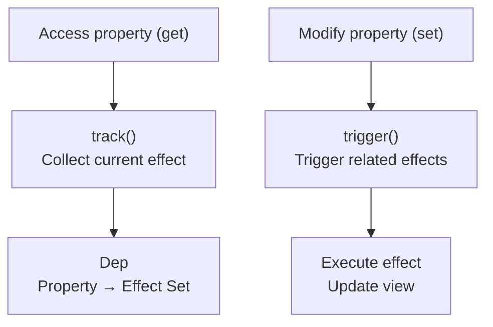
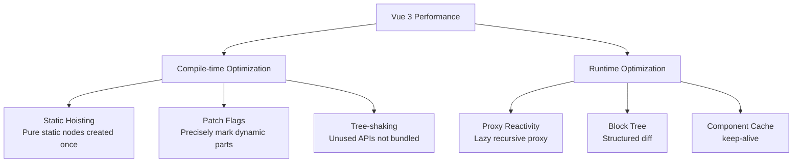

## Vue 3 Reactivity Principles

Vue 3 uses `Proxy` instead of `Object.defineProperty` for reactivity, solving two major pain points of Vue 2: inability to detect property addition/deletion, and inability to detect array index assignment.

### Proxy and Dependency Collection



```javascript
// Simplified reactivity implementation
const targetMap = new WeakMap(); // Store dependency relationships

function reactive(target) {
  return new Proxy(target, {
    get(obj, key, receiver) {
      track(obj, key); // Dependency collection: record "who is reading this property"
      return Reflect.get(obj, key, receiver);
    },
    set(obj, key, value, receiver) {
      const result = Reflect.set(obj, key, value, receiver);
      trigger(obj, key); // Trigger update: notify "this property changed"
      return result;
    },
  });
}
```

**track**: When an `effect` (side effect function) reads a property during execution, this effect is recorded in that property's Dep.

**trigger**: When a property is modified, all dependent effects are retrieved from the Dep and executed.

### Nested Objects and Deep Reactivity

Vue 3 uses a **lazy recursion** strategy: inner properties are only recursively proxied when accessed, not during initialization deep traversal. This significantly improves initialization performance for large objects.

```javascript
const state = reactive({
  user: { name: "Alice" }, // user object is only proxied on first access
  items: [],               // Same for arrays
});
```

## Composition API Design Philosophy

Options API (Vue 2) organizes code by option type: data, methods, computed, watch are scattered across different options. When component functionality becomes complex, code for the same feature is split across multiple options, requiring constant jumping.

Composition API organizes code by **logical concern**:

```javascript
// Code for the same feature is grouped together
function useUser() {
  const user = ref(null);
  const loading = ref(false);

  async function fetchUser(id) {
    loading.value = true;
    user.value = await api.getUser(id);
    loading.value = false;
  }

  return { user, loading, fetchUser };
}

function usePosts(userId) {
  const posts = ref([]);

  watch(userId, (id) => {
    api.getPosts(id).then((data) => (posts.value = data));
  });

  return { posts };
}

// Using in component
export default {
  setup() {
    const { user, loading, fetchUser } = useUser();
    const { posts } = usePosts(computed(() => user.value?.id));
    return { user, loading, fetchUser, posts };
  },
};
```

**Reuse Pattern Comparison**:

| Pattern | Vue 2 Mixins | Composition API |
|------|-------------|-----------------|
| Naming conflicts | Possible conflicts | Explicit destructuring, controllable |
| Source tracing | Unclear which mixin | Clear function call |
| Type inference | Difficult | Full TypeScript support |

## Template Compilation

Vue template compilation has three stages:


### Parse: Template → AST


```html
<div class="app">
  <p>{{ message }}</p>
  <span v-if="show">Visible content</span>
</div>
```


Parsed into an AST node tree, each node containing type, props, children, and other information.

### Transform: Static Flagging

The compiler identifies and flags static subtrees:

- **HoistStatic**: Purely static nodes are created only once, reused directly in subsequent renders
- **Patch Flag**: Dynamic nodes are tagged with change types (TEXT=1, CLASS=2, PROPS=8...), diff only checks flagged parts
- **Block Tree**: Templates are split into Blocks by structural directives (v-if/v-for), diff skips static blocks

### Generate: AST → Render Function

```javascript
// Compiled result (simplified)
import { createElementVNode as _createVNode, toDisplayString as _toDisplayString } from "vue";

export function render(_ctx) {
  return _createVNode("div", { class: "app" }, [
    _createVNode("p", null, _toDisplayString(_ctx.message), 1 /* TEXT */),
    _ctx.show ? _createVNode("span", null, "Visible content") : null,
  ]);
}
```

The `1 /* TEXT */` at the end is a Patch Flag—at runtime, only the `message` binding needs to be checked for changes.

## Vue Router and Pinia

### Vue Router 4

```javascript
const router = createRouter({
  history: createWebHistory(),
  routes: [
    { path: "/", component: Home },
    { path: "/user/:id", component: User, props: true },
    {
      path: "/admin",
      component: Admin,
      children: [{ path: "settings", component: Settings }],
    },
  ],
});

// Navigation guard
router.beforeEach((to, from) => {
  if (to.meta.requiresAuth && !isAuthenticated()) {
    return "/login";
  }
});
```

### Pinia State Management

```javascript
// Define Store
export const useUserStore = defineStore("user", () => {
  const user = ref(null);
  const isLoggedIn = computed(() => !!user.value);

  async function login(credentials) {
    user.value = await api.login(credentials);
  }

  return { user, isLoggedIn, login };
});

// Using in component
const userStore = useUserStore();
userStore.login({ email, password });
```

Pinia vs Vuex: Removed Mutations (write sync operations directly), supports Composition API style definition, full TypeScript inference, smaller bundle size.

## Vue 3 Performance Optimization



- **Tree-shaking**: Vue 3 changed global APIs to named exports; unused features (like `v-model`, `transition`) don't enter the bundle. Base runtime is only ~13KB gzip
- **Static Hoisting**: Nodes like `<div class="static">Content</div>` only create a VNode once, reusing the reference on each render
- **Patch Flags**: During diff, only dynamic bindings are checked, static attributes are skipped, significantly reducing comparison overhead
