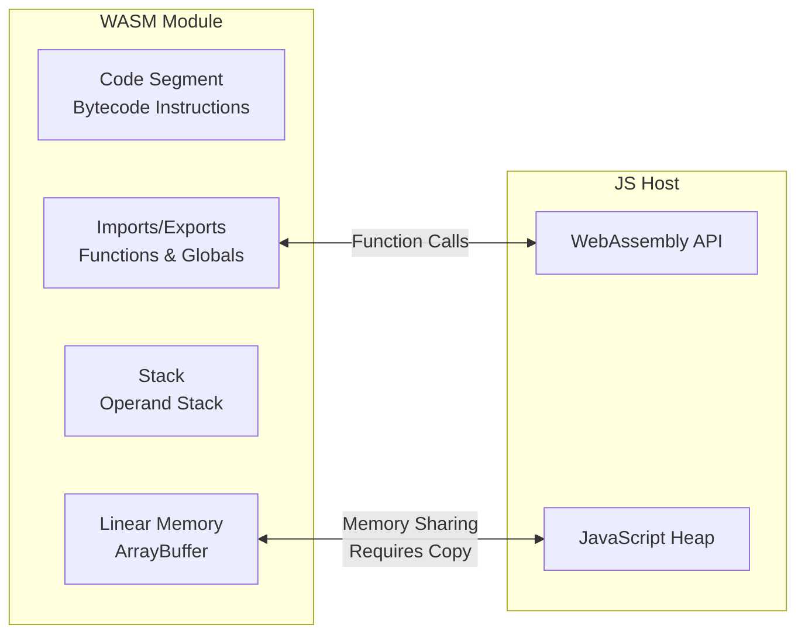
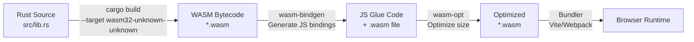
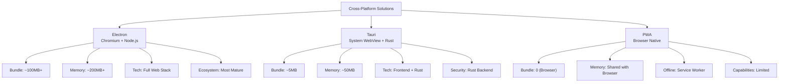
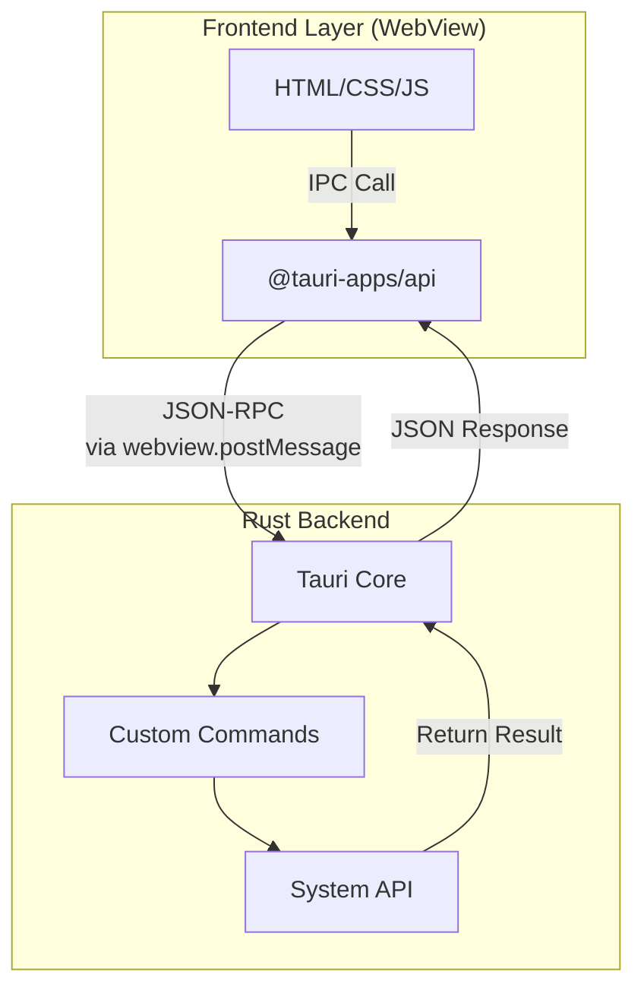

## WebAssembly Principles

WebAssembly (WASM) is a low-level bytecode format that can run in the browser at near-native speed. It's not meant to replace JavaScript, but to work alongside it—JS handles UI and business logic, WASM handles compute-intensive tasks.

### WASM Bytecode and Linear Memory Model

WASM's core design:

- **Stack-based virtual machine**: Operands are passed through a virtual stack; instructions take values from the stack top and push results
- **Linear memory**: A contiguous, growable byte array (ArrayBuffer); WASM modules read/write via offsets. Isolated from the JS heap; interop requires copying
- **Type system**: Only four basic types—i32, i64, f32, f64



### JS and WASM Interop

```javascript
// Load and instantiate WASM module
const { instance } = await WebAssembly.instantiateStreaming(
  fetch("math.wasm")
);

// Call WASM exported function
const result = instance.exports.fibonacci(40);

// Write data to WASM memory
const memory = instance.exports.memory;
const buffer = new Uint8Array(memory.buffer);
const text = new TextEncoder().encode("Hello WASM");
const offset = instance.exports.allocate(text.length);
buffer.set(text, offset);

// Read result from WASM memory
const outputLength = instance.exports.process(offset, text.length);
const output = new TextDecoder().decode(
  buffer.slice(offset, offset + outputLength)
);
```

**Key bottleneck**: Data transfer between JS and WASM requires copying through linear memory. For small data, communication overhead may negate WASM's performance advantage.

## Rust → WASM Compilation Pipeline

Rust is the preferred language for writing WASM—zero-cost abstractions, no GC, naturally aligned with WASM's value semantics.



### wasm-bindgen Example

```rust
// src/lib.rs
use wasm_bindgen::prelude::*;

#[wasm_bindgen]
pub fn fibonacci(n: u32) -> u32 {
    if n <= 1 { return n; }
    let (mut a, mut b) = (0, 1);
    for _ in 2..=n {
        let temp = b;
        b = a + b;
        a = temp;
    }
    b
}

// Accept JS string, return JS string
#[wasm_bindgen]
pub fn process_text(input: &str) -> String {
    input.to_uppercase()
}

// Manipulate DOM
#[wasm_bindgen]
pub fn set_title(title: &str) {
    let document = web_sys::window().unwrap().document().unwrap();
    document.set_title(title);
}
```

```javascript
// JS side usage
import init, { fibonacci, process_text } from "./pkg/my_wasm.js";

async function run() {
  await init(); // Initialize WASM module
  console.log(fibonacci(40));      // 102334155 — extremely fast
  console.log(process_text("hello")); // "HELLO"
}
```

## WASM Performance Scenarios

WASM's advantage is in **compute-intensive** tasks, not all scenarios:

| Scenario | WASM Advantage | Typical Case |
|------|-----------|----------|
| Image/Video Processing | 2-10x | Image compression, video encoding/decoding |
| Cryptography/Hashing | 5-20x | SHA-256, AES encryption |
| Games/Physics Engines | 3-10x | Collision detection, particle systems |
| Data Compression | 2-5x | Gzip, Zstandard |
| Expression Evaluation | 5-15x | SQL parsing, formula calculation |
| DOM Manipulation | ❌ Slower | Communication overhead exceeds compute benefit |
| String Processing | ≈ | Communication overhead negates advantage |

**Core判断**: Large computation, small data transfer → WASM pays off; small computation, large data transfer → JS is faster.

```javascript
// Real benchmark: Fibonacci(40)
// JS:    ~1200ms
// WASM:  ~12ms
// 100x difference, because this is pure computation with no memory communication overhead

// Real benchmark: Processing 1MB JSON
// JS:    ~15ms
// WASM:  ~25ms (serialization/deserialization overhead 15ms + computation 10ms)
```

## Cross-Platform Solution Comparison



| Feature | Electron | Tauri | PWA |
|------|----------|-------|-----|
| Bundle Size | ~100MB+ | ~5-10MB | 0 (Browser) |
| Memory Usage | High (Dedicated Chromium) | Low (System WebView) | Shared browser process |
| System Access | Full (Node.js) | Full (Rust commands) | Limited (Web API) |
| Cross-Platform | Win/Mac/Linux | Win/Mac/Linux | Any browser |
| Native Experience | Average | Good | Depends on implementation |
| Update Mechanism | Full update | Full/Incremental | Automatic (SW) |
| Dev Barrier | Low (Pure Web) | Medium (Requires Rust) | Low (Pure Web) |

### Tauri Architecture

Tauri uses a **Frontend + Rust Backend** dual-layer architecture:



```rust
// src-tauri/src/main.rs
#[tauri::command]
fn greet(name: &str) -> String {
    format!("Hello, {}!", name)
}

#[tauri::command]
fn read_file(path: String) -> Result<String, String> {
    std::fs::read_to_string(&path).map_err(|e| e.to_string())
}

fn main() {
    tauri::Builder::default()
        .invoke_handler(tauri::generate_handler![greet, read_file])
        .run(tauri::generate_context!())
        .expect("Failed to launch");
}
```

```javascript
// Frontend calls Rust commands
import { invoke } from "@tauri-apps/api/core";

const greeting = await invoke("greet", { name: "World" });
const content = await invoke("read_file", { path: "/tmp/data.txt" });
```

Tauri's security model: minimum permissions by default, each command must be explicitly authorized in `capabilities`. This is more secure than Electron's "all permissions" model.

## Selection Guide

- **Desktop app, pure frontend team**: Electron—mature ecosystem, low learning curve
- **Desktop app, prioritizing performance and size**: Tauri—small bundle, low memory, powerful Rust backend
- **Lightweight, no installation needed**: PWA—native browser support, automatic updates
- **Compute-intensive web features**: WASM (Rust)—significant performance gains
- **Hybrid approach**: Tauri + WASM—frontend UI + Rust backend + WASM high-performance computing

The boundaries of frontend technology continue to expand—from browser to desktop, from JS to WASM, from single-page apps to cross-platform convergence. Understanding the suitable scenarios for each technology enables correct architectural decisions.
