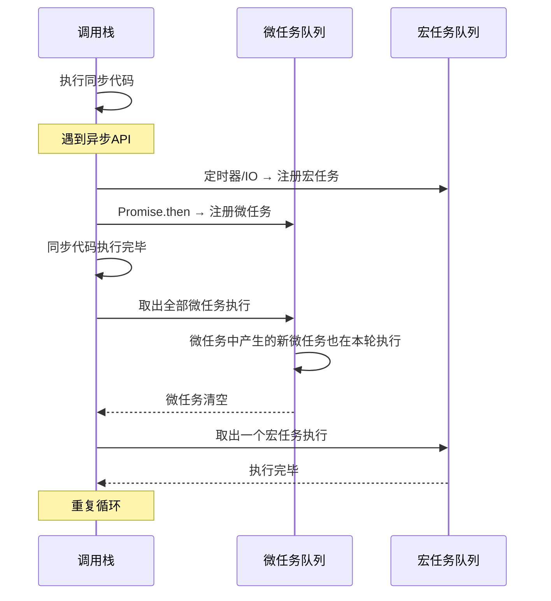

## 浏览器事件循环

JavaScript 是单线程语言，但浏览器并非只靠一个线程工作。事件循环（Event Loop）是协调调用栈与任务队列的调度机制。



**宏任务**：`setTimeout`、`setInterval`、I/O、UI 渲染、`requestAnimationFrame`、事件回调

**微任务**：`Promise.then/catch/finally`、`MutationObserver`、`queueMicrotask`

**核心规则**：每执行完一个宏任务，必须清空全部微任务，才会执行下一个宏任务。

```javascript
console.log("1");                    // 同步
setTimeout(() => console.log("2"));   // 宏任务
Promise.resolve().then(() => {        // 微任务
  console.log("3");
  Promise.resolve().then(() => console.log("4")); // 微任务中的微任务
});
console.log("5");                    // 同步
// 输出: 1, 5, 3, 4, 2
```

## Promise 链式调用与错误处理

Promise 表示一个异步操作的最终结果——三种状态：**pending → fulfilled** 或 **pending → rejected**，状态一旦确定不可逆。

### 链式调用

```javascript
fetch("/api/user/1")
  .then(res => res.json())       // 返回新 Promise
  .then(user => fetch(`/api/posts?userId=${user.id}`))
  .then(res => res.json())
  .then(posts => renderPosts(posts))
  .catch(err => console.error("链中任一环节出错:", err));
```

`then` 返回新 Promise，形成链式调用。`catch` 是 `.then(null, onRejected)` 的语法糖，捕获链中任何环节的错误。

### 错误处理最佳实践

```javascript
// 不推荐：吞掉错误
async function loadUser() {
  const res = await fetch("/api/user");
  return res.json(); // 网络错误被默默吞掉
}

// 推荐：显式错误处理
async function loadUser() {
  try {
    const res = await fetch("/api/user");
    if (!res.ok) throw new Error(`HTTP ${res.status}`);
    return await res.json();
  } catch (err) {
    console.error("加载用户失败:", err.message);
    return null; // 优雅降级
  }
}
```

## async/await 原理

`async/await` 是 Promise 的语法糖，让异步代码看起来像同步代码：

```javascript
// Promise 写法
function loadDashboard() {
  return fetchUser()
    .then(user => fetchPosts(user.id))
    .then(posts => ({ user, posts }));
}

// async/await 写法
async function loadDashboard() {
  const user = await fetchUser();
  const posts = await fetchPosts(user.id);
  return { user, posts };
}
```

`async` 函数始终返回 Promise。`await` 暂停函数执行，等待 Promise 解决后继续。**注意**：`await` 只暂停当前 async 函数，不会阻塞主线程。

### 并行执行

```javascript
// 串行 — 总耗时 = A + B
const a = await taskA(); // 等 A 完成
const b = await taskB(); // 再等 B

// 并行 — 总耗时 = max(A, B)
const [a, b] = await Promise.all([taskA(), taskB()]);
```

## 并发控制：Promise 组合方法

| 方法 | 行为 | 全部成功 | 有一个失败 |
|------|------|----------|------------|
| `Promise.all` | 等待全部 | 返回结果数组 | 第一个拒绝 |
| `Promise.allSettled` | 等待全部 | 返回状态+值数组 | 不会拒绝 |
| `Promise.race` | 取最快 | 第一个结果 | 第一个拒绝 |
| `Promise.any` | 取最快成功 | 第一个成功 | 全部失败才拒绝 |

```javascript
// 批量请求，容忍部分失败
const results = await Promise.allSettled([
  fetch("/api/a"),
  fetch("/api/b"),
  fetch("/api/c"),
]);
const succeeded = results
  .filter(r => r.status === "fulfilled")
  .map(r => r.value);
```

**实战选型**：需要全部成功用 `all`，容忍部分失败用 `allSettled`，超时竞速用 `race`，优先最快成功用 `any`。

## 异步场景实战

### 请求取消

```javascript
const controller = new AbortController();

fetch("/api/data", { signal: controller.signal })
  .then(res => res.json())
  .catch(err => {
    if (err.name === "AbortError") {
      console.log("请求已取消");
    }
  });

// 用户切换页面时取消
controller.abort();
```

### 重试机制

```javascript
async function fetchWithRetry(url, retries = 3, delay = 1000) {
  for (let i = 0; i < retries; i++) {
    try {
      const res = await fetch(url);
      if (!res.ok) throw new Error(`HTTP ${res.status}`);
      return await res.json();
    } catch (err) {
      if (i === retries - 1) throw err;
      await new Promise(r => setTimeout(r, delay * (i + 1))); // 指数退避
    }
  }
}
```

### 防抖与节流

```javascript
// 防抖：延迟执行，重复触发时重新计时
function debounce(fn, delay) {
  let timer;
  return (...args) => {
    clearTimeout(timer);
    timer = setTimeout(() => fn(...args), delay);
  };
}

// 节流：固定间隔执行，忽略间隔内的重复触发
function throttle(fn, interval) {
  let last = 0;
  return (...args) => {
    const now = Date.now();
    if (now - last >= interval) {
      last = now;
      fn(...args);
    }
  };
}
```

**选型**：搜索框输入 → 防抖（等用户停顿再搜索）；滚动事件 → 节流（固定频率处理）；窗口 resize → 防抖（等调整完毕再计算布局）。
