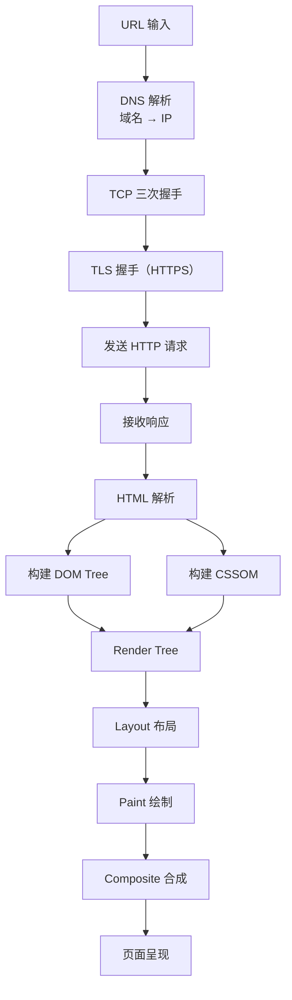
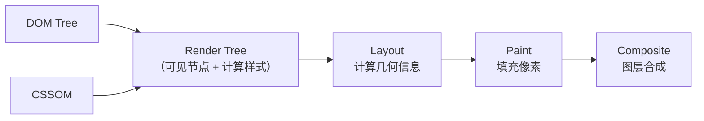
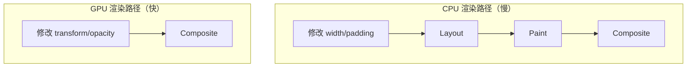

## 从 URL 输入到页面渲染

在浏览器地址栏输入 URL 并按下回车后，全链路大致如下：



关键步骤详解：

1. **DNS 解析**：浏览器缓存 → OS 缓存 → 路由器缓存 → ISP DNS → 递归查询。`dns-prefetch` 可以提前解析域名
2. **TCP 连接**：三次握手建立可靠连接。HTTP/2 多路复用后同一连接可并行多个请求
3. **HTTP 请求/响应**：请求头携带缓存信息（If-Modified-Since、ETag），响应可能 304 直接用缓存

## HTML 解析与 DOM/CSSOM 构建

### DOM Tree 构建

HTML 解析器以**增量方式**处理文档，不需要等整个文档下载完：

1. **字节 → 字符**：根据编码（UTF-8）将字节流解码为字符
2. **字符 → Token**：词法分析，识别标签名、属性、文本
3. **Token → Node**：根据 Token 创建 DOM 节点
4. **Node → DOM Tree**：根据嵌套关系组装树结构

**关键细节**：遇到 `<script>` 标签会暂停 DOM 构建，因为脚本可能修改 DOM。`async` 和 `defer` 属性可以改变这一行为。

### CSSOM 构建

CSS 解析与 DOM 解析可以并行，但 CSS 会阻塞渲染——必须等 CSSOM 构建完成才能进入下一步，因为样式可能影响布局。

## 渲染管线



### Render Tree

Render Tree 只包含**可见节点**。`display: none` 的元素不在 Render Tree 中（不占空间）；`visibility: hidden` 的元素仍在 Render Tree 中（占空间但不可见）。`::before`/`::after` 伪元素也会出现在 Render Tree 中。

### Layout（布局/回流）

计算每个节点的精确位置和尺寸——x、y、width、height。这是从 Render Tree 到几何信息的映射过程。

### Paint（绘制）

将布局后的节点转化为屏幕上的像素。绘制分为多个层次：背景色 → 背景图 → 边框 → 子元素 → 轮廓。

### Composite（合成）

将不同图层按正确顺序合成最终画面。拥有独立图层的元素可以在不影响其他图层的情况下独立更新。

## 回流与重绘

### 回流（Reflow）

当布局信息发生变化时触发回流，重新计算受影响节点的几何属性。触发回流的操作：

- 添加/删除 DOM 元素
- 修改 `width`、`height`、`padding`、`margin`、`position`
- 读取 `offsetWidth`、`scrollTop`、`getComputedStyle()` 等强制同步布局的属性
- 窗口 resize、字体变化

### 重绘（Repaint）

当外观属性变化但不影响布局时触发重绘。如修改 `color`、`background`、`visibility`、`box-shadow`。

### 优化策略

```javascript
// 差：逐条修改样式，每次可能触发回流
element.style.width = "100px";
element.style.height = "200px";
element.style.margin = "10px";

// 好：批量修改，只触发一次回流
element.style.cssText = "width:100px;height:200px;margin:10px;";

// 好：使用 class 切换
element.classList.add("expanded");

// 好：脱离文档流后修改
element.style.display = "none";       // 触发一次回流
element.style.width = "100px";        // 不可见，不触发回流
element.style.height = "200px";
element.style.display = "";           // 触发一次回流

// 好：使用 DocumentFragment 批量插入
const fragment = document.createDocumentFragment();
items.forEach(item => fragment.appendChild(createItem(item)));
container.appendChild(fragment); // 只触发一次回流
```

**读写分离**：避免在同一个帧内交替读写布局属性，否则会强制同步布局。

## 关键渲染路径优化

关键渲染路径是从接收 HTML 到首次像素渲染的最短路径。优化目标：**尽快完成首次有意义渲染（FMP）**。

```html
<!-- CSS 放 head，尽早开始构建 CSSOM -->
<link rel="stylesheet" href="style.css">

<!-- 非关键 CSS 异步加载 -->
<link rel="stylesheet" href="print.css" media="print" onload="this.media='all'">

<!-- JS 放 body 底部，或使用 defer -->
<script src="app.js" defer></script>

<!-- 预加载关键资源 -->
<link rel="preload" href="critical-font.woff2" as="font" crossorigin>
<link rel="preconnect" href="https://cdn.example.com">
```

关键策略：
- **减少关键资源数量**：异步加载非关键 CSS/JS
- **减少关键资源大小**：压缩、Tree-shaking、内联关键 CSS
- **缩短关键路径长度**：`defer` 让 JS 不阻塞解析

## GPU 加速与 Composite Layer

某些 CSS 属性可以将元素提升到独立合成图层，由 GPU 处理：

```css
/* 触发合成图层的常见方式 */
.gpu-accelerated {
  transform: translateZ(0);     /* 经典 hack */
  will-change: transform;       /* 现代方式，提示浏览器预优化 */
  /* 或 opacity + transform 的组合动画 */
}
```

**为什么 GPU 加速快**：`transform` 和 `opacity` 的变化不需要 Layout 和 Paint，只走 Composite 阶段。GPU 擅长处理位图变换（移动、旋转、缩放、透明度）。

**注意事项**：图层过多会增加内存消耗（每个图层都是独立位图），移动端尤其敏感。只在动画元素上使用 `will-change`，动画结束后移除。



总结：理解渲染管线的意义在于——知道哪些操作代价高（回流），哪些代价低（合成），从而在代码层面做出正确选择。
