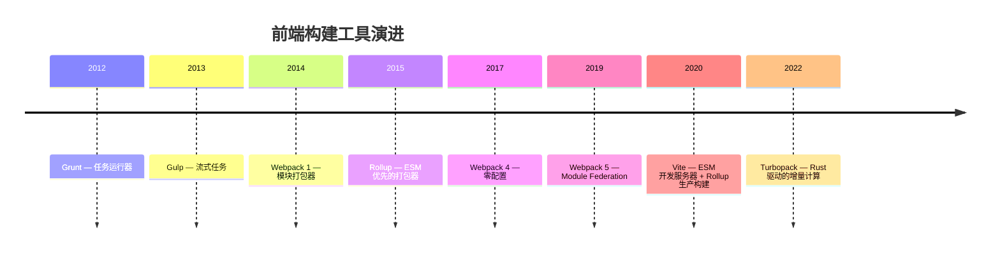
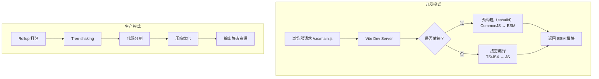

## 构建工具演进



| 工具 | 定位 | 开发体验 | 构建速度 | 适用场景 |
|------|------|----------|----------|----------|
| Webpack | 全能打包器 | 配置复杂，启动慢 | 慢（大型项目 30s+） | 复杂应用、遗留项目 |
| Rollup | 库打包器 | 简洁 | 中等 | 库/NPM 包开发 |
| Vite | 下一代构建 | 极速 HMR | 快（毫秒级 HMR） | 新项目首选 |
| Turbopack | 增量计算 | 极快 | 极快（Rust） | Next.js 集成 |

## Vite 核心原理

Vite 的核心理念：**开发时利用浏览器原生 ESM，生产时用 Rollup 打包**。



### 为什么 Vite 快？

1. **不打包，按需编译**：开发时不需要打包整个应用，浏览器请求哪个模块就编译哪个
2. **esbuild 预构建**：用 Go 编写的 esbuild 处理依赖预构建，比 JS 工具快 10-100 倍
3. **HMR 精准更新**：修改文件后只重新编译该模块及其依赖链，不需要重新打包整个应用

```javascript
// vite.config.js
import { defineConfig } from "vite";
import react from "@vitejs/plugin-react";

export default defineConfig({
  plugins: [react()],
  build: {
    rollupOptions: {
      output: {
        manualChunks: {
          vendor: ["react", "react-dom"],
          utils: ["lodash-es"],
        },
      },
    },
  },
  server: {
    proxy: {
      "/api": "http://localhost:3000",
    },
  },
});
```

### Vite 插件机制

Vite 插件基于 Rollup 插件接口扩展，增加了 Vite 特有的钩子：

| 钩子 | 阶段 | 用途 |
|------|------|------|
| `configResolved` | 配置解析后 | 读取最终配置 |
| `configureServer` | 服务器启动时 | 添加中间件、自定义路由 |
| `transformIndexHtml` | HTML 转换 | 注入脚本、修改 head |
| `handleHotUpdate` | HMR 触发时 | 自定义热更新逻辑 |

## Module Federation

Module Federation 允许多个独立构建的应用在运行时共享模块：

```javascript
// 应用 A（主机） — webpack.config.js
new ModuleFederationPlugin({
  name: "host",
  remotes: {
    remoteApp: "remoteApp@http://cdn.example.com/remoteEntry.js",
  },
});

// 应用 B（远程） — webpack.config.js
new ModuleFederationPlugin({
  name: "remoteApp",
  filename: "remoteEntry.js",
  exposes: {
    "./UserProfile": "./src/components/UserProfile",
  },
  shared: {
    react: { singleton: true },
    "react-dom": { singleton: true },
  },
});
```

```jsx
// 应用 A 中直接引用应用 B 的组件
const UserProfile = React.lazy(() => import("remoteApp/UserProfile"));
```

应用场景：**微前端**、**独立团队独立部署**、**共享组件库运行时加载**。

## Tree-shaking 原理

Tree-shaking 基于 ES Modules 的静态分析，移除未使用的导出：

```javascript
// utils.js
export function used() { return "我被使用了"; }
export function unused() { return "我没被使用"; }

// main.js
import { used } from "./utils.js";
console.log(used()); // unused() 不会出现在最终打包中
```

**生效条件**：
1. 必须使用 ES Modules（`import/export`），CommonJS 的 `require` 是动态的无法分析
2. 导出必须是明确引用，不能通过动态属性访问
3. 副作用标记：`package.json` 中 `"sideEffects": false` 告诉打包器此包无副作用，可放心移除

```javascript
// 有副作用 — 无法 Tree-shake
export default {
  install(Vue) { Vue.component("MyPlugin", Component); }, // 副作用：注册组件
};

// 无副作用 — 可 Tree-shake
export function useFeature() { return ref(0); } // 纯函数
```

## 构建性能优化

### 缓存策略

```javascript
// Vite 配置缓存
export default defineConfig({
  cacheDir: "node_modules/.vite", // 默认缓存预构建结果
  build: {
    rollupOptions: {
      output: {
        // 内容哈希，实现长期缓存
        chunkFileNames: "assets/[name]-[hash].js",
        entryFileNames: "assets/[name]-[hash].js",
        assetFileNames: "assets/[name]-[hash][extname]",
      },
    },
  },
});
```

### 并行编译

```javascript
// Vite 使用 esbuild 做预构建（天然并行）
// 也可使用 worker 线程并行处理
import { workerThreads } from "node:worker_threads";

// SWC 替代 Babel — Rust 编写，并行编译
// @vitejs/plugin-react-swc 代替 @vitejs/plugin-react
```

### 增量构建

```bash
# Vite 开发模式天然增量 — 只编译变更模块
# 生产构建的增量编译仍在发展中
vite build --watch  # 监听模式

# Turbopack 的增量计算 — 缓存每个函数级别的计算结果
# next dev --turbo
```

### 构建产物分析

```bash
# 分析打包体积
npx vite-bundle-visualizer

# 或使用 rollup-plugin-visualizer
import { visualizer } from "rollup-plugin-visualizer";
plugins: [visualizer({ open: true })]
```

通过可视化分析发现：过大的依赖、重复打包、未 Tree-shake 的模块，针对性优化。
