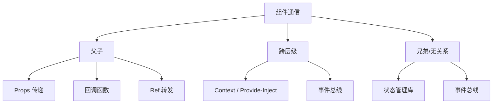

## 组件设计原则

### 单一职责

一个组件只做一件事。判断标准：如果一个组件有超过一个理由去改变，它就承担了过多职责。

```jsx
// 差：UserProfile 既展示信息又编辑信息
function UserProfile({ user, onSave }) { /* ... */ }

// 好：拆分展示与编辑
function UserProfileCard({ user }) { /* 只读展示 */ }
function UserProfileForm({ user, onSave }) { /* 编辑表单 */ }
```

### 接口契约

组件的 Props 就是它的 API。好的接口设计遵循：

- **最小化**：只传必要的数据，不传整个对象
- **明确性**：用 TypeScript 定义 Props 类型
- **默认值**：为可选 Props 提供合理默认值

```typescript
interface ButtonProps {
  variant: "primary" | "secondary" | "danger"; // 联合类型限制选项
  size?: "sm" | "md" | "lg";                   // 可选，有默认值
  disabled?: boolean;
  onClick?: () => void;
  children: React.ReactNode;
}
```

### 受控与非受控

```jsx
// 受控组件：状态由外部控制
function Input({ value, onChange }) {
  return <input value={value} onChange={(e) => onChange(e.target.value)} />;
}

// 非受控组件：状态由内部管理
function Input({ defaultValue }) {
  const [value, setValue] = useState(defaultValue);
  return <input value={value} onChange={(e) => setValue(e.target.value)} />;
}
```

**选择原则**：表单数据需要实时校验/联动/提交 → 受控；简单输入不需要外部感知 → 非受控。也可以设计为同时支持两种模式：

```jsx
function Input({ value: controlledValue, defaultValue, onChange }) {
  const isControlled = controlledValue !== undefined;
  const [internalValue, setInternalValue] = useState(defaultValue);
  const value = isControlled ? controlledValue : internalValue;

  return (
    <input
      value={value}
      onChange={(e) => {
        if (!isControlled) setInternalValue(e.target.value);
        onChange?.(e.target.value);
      }}
    />
  );
}
```

## 组件通信模式



| 模式 | 适用场景 | 特点 |
|------|----------|------|
| Props / Events | 父子 | 最直接，数据流清晰 |
| Provide / Inject | 祖先后代 | 跨层级传递，避免逐层 Props |
| Ref + ImperativeHandle | 父调子方法 | 暴露命令式 API（如 focus、scroll） |
| 状态管理 | 全局共享 | 单一数据源，跨组件同步 |
| 事件总线 | 任意组件 | 解耦但难追踪，谨慎使用 |

```jsx
// Ref 转发：父组件调用子组件方法
const Input = forwardRef((props, ref) => {
  const inputRef = useRef();
  useImperativeHandle(ref, () => ({
    focus: () => inputRef.current.focus(),
    clear: () => { inputRef.current.value = ""; },
  }));
  return <input ref={inputRef} />;
});

// 父组件
const inputRef = useRef();
inputRef.current.focus(); // 命令式调用
```

## 复用模式演进

### 高阶组件（HOC）

```jsx
// 包装组件注入额外能力
function withAuth(WrappedComponent) {
  return function AuthComponent(props) {
    const { user } = useAuth();
    if (!user) return <Redirect to="/login" />;
    return <WrappedComponent {...props} user={user} />;
  };
}
const ProtectedPage = withAuth(Dashboard);
```

问题：嵌套地狱（`withA(withB(withC(Component)))`）、Props 来源不明、Ref 丢失。

### Render Props

```jsx
function MouseTracker({ render }) {
  const [position, setPosition] = useState({ x: 0, y: 0 });
  // ...监听鼠标移动
  return render(position);
}

<MouseTracker render={({ x, y }) => <Cursor x={x} y={y} />} />
```

问题：回调嵌套难读、无法在 `shouldComponentUpdate` 中优化。

### Hooks 复用

```jsx
function useAuth() {
  const [user, setUser] = useState(null);
  const login = useCallback(async (credentials) => {
    const data = await api.login(credentials);
    setUser(data);
  }, []);
  return { user, login, isLoggedIn: !!user };
}

// 使用：逻辑与状态天然聚合
function Dashboard() {
  const { user, isLoggedIn } = useAuth();
  if (!isLoggedIn) return <Navigate to="/login" />;
  return <h1>欢迎, {user.name}</h1>;
}
```

Hooks 成为现代主流复用模式：无嵌套、来源清晰、类型安全。

## 组件库设计

### Design Token

Design Token 是设计系统的原子变量——颜色、间距、字号、阴影等：

```css
:root {
  /* 颜色 */
  --color-primary-500: #3b82f6;
  --color-danger-500: #ef4444;
  /* 间距 */
  --spacing-xs: 4px;
  --spacing-sm: 8px;
  --spacing-md: 16px;
  /* 字号 */
  --font-size-sm: 12px;
  --font-size-md: 14px;
  --font-size-lg: 18px;
  /* 圆角 */
  --radius-sm: 4px;
  --radius-md: 8px;
}
```

### 主题系统

```jsx
// 运行时主题切换
const themes = {
  light: { "--color-bg": "#ffffff", "--color-text": "#1f2328" },
  dark: { "--color-bg": "#0d1117", "--color-text": "#e6edf3" },
};

function ThemeProvider({ theme, children }) {
  return (
    <div style={themes[theme]}>
      {children}
    </div>
  );
}
```

### 无障碍（A11y）

```jsx
function Dialog({ open, onClose, title, children }) {
  return (
    <div role="dialog" aria-modal="true" aria-labelledby="dialog-title"
         hidden={!open}>
      <h2 id="dialog-title">{title}</h2>
      {children}
      <button onClick={onClose} aria-label="关闭对话框">✕</button>
    </div>
  );
}
```

关键原则：语义化 HTML、ARIA 属性、键盘可操作、颜色对比度达标。

## Storybook 驱动的组件文档与测试

Storybook 为组件提供隔离的开发环境：

```jsx
// Button.stories.jsx
export default {
  title: "Components/Button",
  component: Button,
  argTypes: {
    variant: { control: "select", options: ["primary", "secondary", "danger"] },
  },
};

export const Primary = {
  args: { variant: "primary", children: "点击我" },
};

export const Disabled = {
  args: { variant: "primary", disabled: true, children: "已禁用" },
};
```

Storybook 的价值：
- **可视化文档**：每个 Story 就是组件的一种用法
- **交互测试**：结合 Playwright 做交互测试
- **视觉回归**：Chromatic 截图对比，防止样式意外变更
- **开发隔离**：不受应用状态影响，专注组件本身
