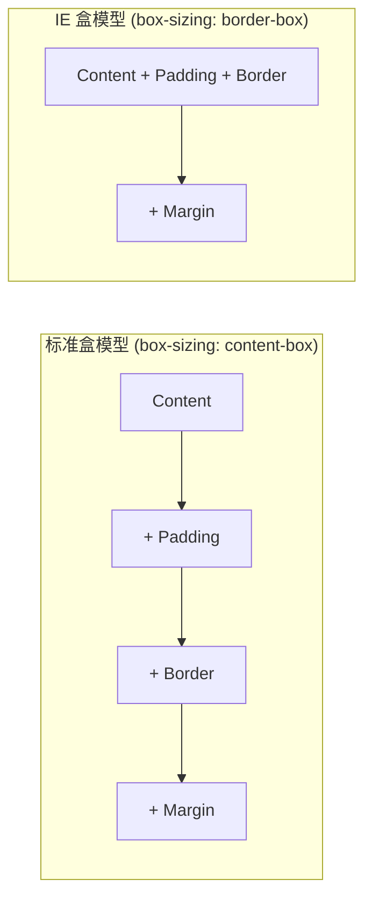
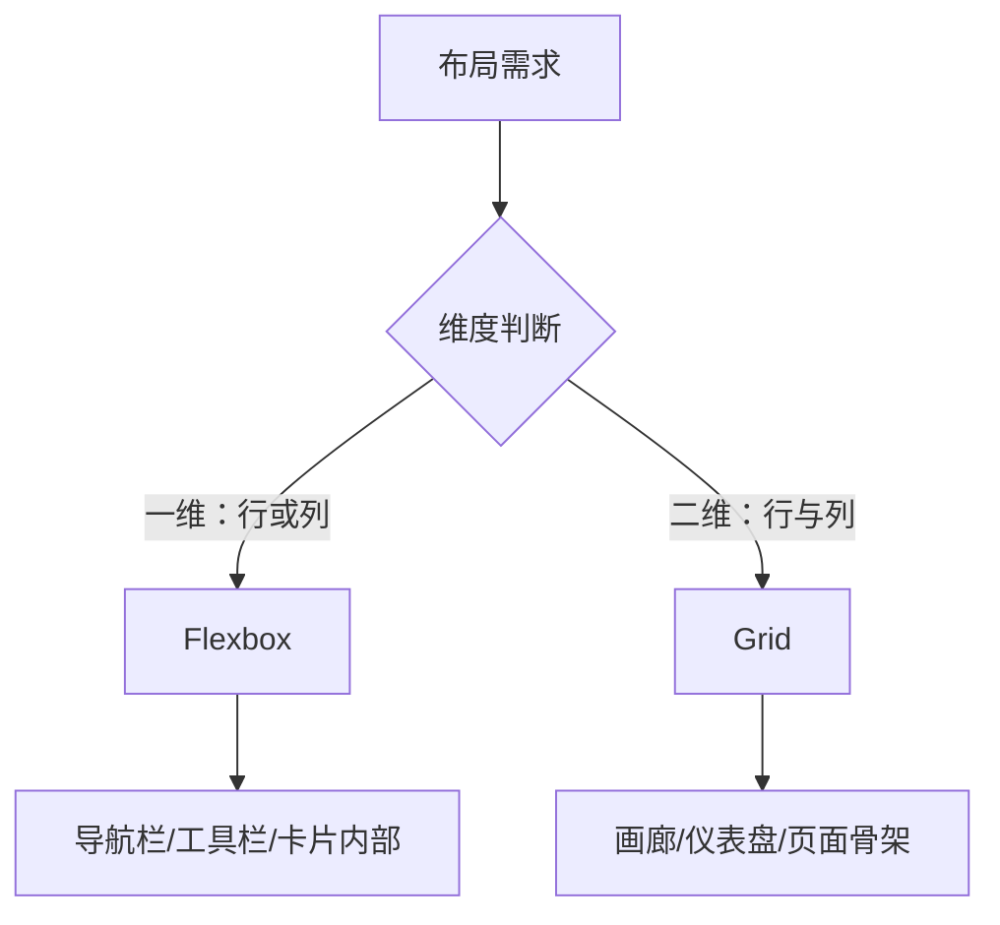
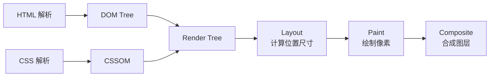

## HTML5 语义化标签体系

HTML5 引入了一批语义化标签，让文档结构自解释。不再是满屏 `<div>`，而是用 `<header>`、`<nav>`、`<main>`、`<article>`、`<section>`、`<aside>`、`<footer>` 等标签清晰地描述内容区域。

```html
<header>
  <nav aria-label="主导航">
    <a href="/">首页</a>
    <a href="/blog">博客</a>
  </nav>
</header>
<main>
  <article>
    <h1>文章标题</h1>
    <section>
      <h2>第一节</h2>
      <p>正文内容...</p>
    </section>
  </article>
  <aside>
    <h2>侧边栏</h2>
  </aside>
</main>
<footer>版权信息</footer>
```

语义化的好处：**SEO 友好**（搜索引擎更容易理解页面结构）、**无障碍**（屏幕阅读器可以快速导航）、**可维护性**（代码即文档）。实际开发中，判断标准很简单——看到标签就知道这块内容的角色，就是语义化。

## CSS 盒模型

每个 HTML 元素在页面中都占据一个矩形区域，由内到外依次是：**content → padding → border → margin**。



**标准盒模型**下，`width` 只指 content 宽度，实际渲染宽度 = `width + padding + border`。**IE 盒模型**（也叫怪异模式）下，`width` 包含 content + padding + border。现代开发几乎全局使用 `border-box`：

```css
*, *::before, *::after {
  box-sizing: border-box;
}
```

### BFC 与层叠上下文

**BFC（块格式化上下文）** 是一个独立的渲染区域，内部元素不会影响外部。触发 BFC 的常见方式：`overflow: hidden`、`display: flow-root`、`float`、`position: absolute/fixed`。

BFC 的实战价值：
- **清除浮动**：父元素 `overflow: hidden` 或 `display: flow-root` 阻止子元素浮动导致的高度塌陷
- **阻止外边距合并**：相邻块元素的上外边距会合并，BFC 可以隔离
- **阻止元素被浮动元素覆盖**：实现两列自适应布局

**层叠上下文**决定元素的 Z 轴渲染顺序。触发条件包括：`position` + `z-index`、`opacity < 1`、`transform`、`filter`、`will-change` 等。理解层叠上下文可以避免 z-index 战争。

## Flexbox 与 Grid 布局

### Flexbox：一维布局

Flexbox 擅长处理单行或单列的排列问题——项目在主轴上的分布与对齐：

```css
.container {
  display: flex;
  justify-content: space-between; /* 主轴分布 */
  align-items: center;            /* 交叉轴对齐 */
  gap: 16px;                      /* 间距 */
}
.item {
  flex: 1; /* 等分剩余空间 */
}
```

典型场景：导航栏（左 logo 右菜单）、卡片内文字与图标的排列、表单行（label + input + button）。

### Grid：二维布局

Grid 擅长处理行与列同时控制的布局问题：

```css
.grid {
  display: grid;
  grid-template-columns: repeat(auto-fill, minmax(280px, 1fr));
  gap: 24px;
}
```

典型场景：图片画廊、仪表盘面板、杂志排版。



**选择原则**：一维用 Flex，二维用 Grid。实际项目中两者经常嵌套使用——Grid 做页面骨架，Flex 处理组件内部排列。

## 选择器优先级与继承

优先级从高到低：

| 优先级 | 来源 | 示例 |
|--------|------|------|
| 最高 | `!important` | `color: red !important` |
| 高 | 内联样式 | `style="color: red"` |
| 中 | ID 选择器 | `#header { }` — 权重 (1,0,0) |
| 中低 | 类/属性/伪类 | `.nav { }` — 权重 (0,1,0) |
| 低 | 元素/伪元素 | `div { }` — 权重 (0,0,1) |

同权重下，后声明者覆盖前者。**继承**是指某些属性（如 `color`、`font-family`）会从父元素传递给子元素，但盒模型属性（`margin`、`padding`、`border`、`width`、`height`）不继承。

实战建议：避免 `!important`，避免嵌套过深的选择器（如 `.a .b .c .d`），优先使用单一类名。

## 响应式设计

### 媒体查询

```css
/* 移动优先 */
.container {
  padding: 16px;
}
@media (min-width: 769px) {
  .container {
    padding: 32px;
    max-width: 1280px;
  }
}
```

### 相对单位体系

- **rem**：基于根元素字号，适合间距和字体。1rem = 16px（浏览器默认）
- **em**：基于当前元素字号，适合组件内部比例
- **vw/vh**：基于视口尺寸，适合全屏布局
- **%**：基于父元素尺寸

```css
html { font-size: 14px; } /* 基准 */
h1 { font-size: 2rem; }    /* 28px */
.card { padding: 1.5rem; } /* 21px */
.hero { height: 100vh; }   /* 全屏高度 */
```

### 容器查询（现代 CSS）

```css
.card-container {
  container-type: inline-size;
}
@container (min-width: 400px) {
  .card { flex-direction: row; }
}
```

容器查询让组件根据自身容器大小响应，而非视口——真正实现组件级别的响应式。

## 渲染流程概览



理解这个流程对性能优化至关重要：修改 `width`/`height` 触发 Layout 回流（代价高），修改 `color`/`background` 只触发 Paint 重绘（中等），修改 `transform`/`opacity` 只触发 Composite 合成（代价最低）。后续文章会深入讲解浏览器渲染原理。
