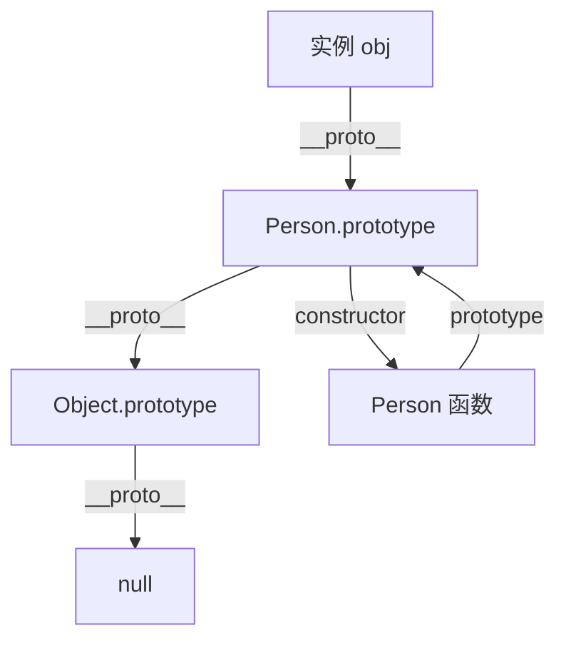
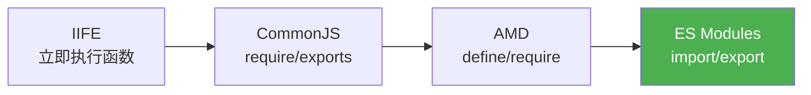

## 执行上下文与调用栈

JavaScript 引擎执行代码时，会创建**执行上下文（Execution Context）**。每个上下文包含三部分：

- **变量环境（Variable Environment）**：存储 var 声明和函数声明
- **词法环境（Lexical Environment）**：存储 let/const 声明
- **this 绑定**：由调用方式决定

执行上下文的生命周期：创建 → 执行 → 回收。调用栈（Call Stack）管理上下文的进出：

```javascript
function greet(name) {
  return `Hello, ${name}`;
}
function start() {
  const msg = greet("World");
  console.log(msg);
}
start();
// 调用栈变化: start() → greet() → 返回 → console.log() → 返回
```

调用栈是后进先出（LIFO）结构。当调用栈过深时会抛出 **RangeError: Maximum call stack size exceeded**，即栈溢出——典型场景是递归没有终止条件。

## 闭包、作用域链与变量提升

### 作用域链

JavaScript 采用**词法作用域（Lexical Scope）**——函数的作用域在定义时确定，而非调用时。引擎通过作用域链查找变量：从当前作用域开始，逐层向外查找直到全局。

### 闭包

闭包是指函数能够访问其词法作用域中的变量，即使函数在该作用域之外执行：

```javascript
function createCounter() {
  let count = 0; // 被闭包捕获
  return {
    increment: () => ++count,
    getCount: () => count,
  };
}
const counter = createCounter();
counter.increment(); // 1
counter.increment(); // 2
counter.getCount();  // 2
```

闭包的实战价值：**数据私有化**（模块模式）、**函数工厂**（柯里化）、**回调保持状态**（事件处理）。注意闭包会阻止垃圾回收，使用不当可能造成内存泄漏。

### 变量提升

```javascript
console.log(a); // undefined（var 提升，赋值不提升）
console.log(b); // ReferenceError（let 暂时性死区 TDZ）
var a = 1;
let b = 2;
```

`var` 声明被提升到作用域顶部并初始化为 `undefined`；`let`/`const` 声明也被提升，但在声明语句之前处于**暂时性死区（TDZ）**，访问会报错。函数声明会整体提升（包括函数体），而函数表达式只提升变量声明。

## 原型链与继承

JavaScript 的继承基于原型链，而非类。每个对象都有一个内部属性 `[[Prototype]]`，指向其原型对象。



属性查找沿原型链向上搜索：`obj.name` → `obj.__proto__.name` → `obj.__proto__.__proto__.name` → ... → `null`。

### 继承模式演进

```javascript
// 1. 原型链继承
Child.prototype = new Parent();

// 2. 构造函数继承
function Child() {
  Parent.call(this);
}

// 3. 组合继承（最常用 ES5 方式）
function Child() {
  Parent.call(this);           // 实例属性
}
Child.prototype = Object.create(Parent.prototype); // 原型方法
Child.prototype.constructor = Child;

// 4. ES6 class 语法糖
class Child extends Parent {
  constructor() {
    super();
  }
}
```

`class` 本质是原型链的语法糖，但写法更清晰、更接近其他语言的习惯。

## ES6+ 核心特性

### 解构赋值

```javascript
// 数组解构
const [first, , third] = [1, 2, 3];

// 对象解构 + 重命名 + 默认值
const { name: userName = "匿名", age } = user;

// 函数参数解构
function render({ title, items = [] }) {
  // ...
}
```

### 箭头函数

箭头函数没有自己的 `this`、`arguments`、`super`，它从外层词法作用域继承 `this`：

```javascript
const team = {
  members: ["Alice", "Bob"],
  list() {
    // 箭头函数继承 this，指向 team
    this.members.forEach(member => console.log(member, this.members));
  },
};
```

### Symbol 与 Iterator

```javascript
// Symbol — 唯一标识符
const id = Symbol("id");
const user = { [id]: 123, name: "Alice" };

// Iterator — 统一遍历接口
const range = {
  from: 1,
  to: 5,
  [Symbol.iterator]() {
    let current = this.from;
    return {
      next: () => current <= this.to
        ? { value: current++, done: false }
        : { done: true },
    };
  },
};
[...range]; // [1, 2, 3, 4, 5]
```

实现 `Symbol.iterator` 协议的对象都可用 `for...of` 和展开运算符遍历。

## 模块化演进



| 规范 | 加载方式 | 适用场景 | 特点 |
|------|----------|----------|------|
| IIFE | 同步 | 早期浏览器 | 全局污染隔离，无法依赖管理 |
| CommonJS | 同步 | Node.js | 运行时加载，值的拷贝 |
| AMD | 异步 | 早期浏览器 | RequireJS，语法繁琐 |
| ES Modules | 静态 | 浏览器 + Node | 编译时静态分析，值的引用，Tree-shaking 友好 |

```javascript
// ES Modules — 现代标准
export const API_BASE = "/api";
export function fetchUser(id) { /* ... */ }
export default class UserService { /* ... */ }

// 导入
import UserService, { API_BASE } from "./user.js";
```

ES Modules 的静态特性使得构建工具能在编译阶段分析依赖图，实现 Tree-shaking——移除未使用的代码。这是 Vite、Rollup 等现代构建工具的基石。
