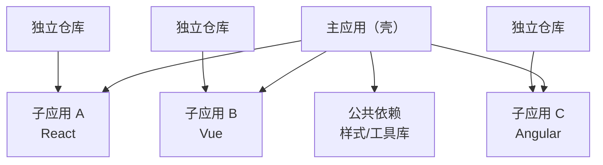
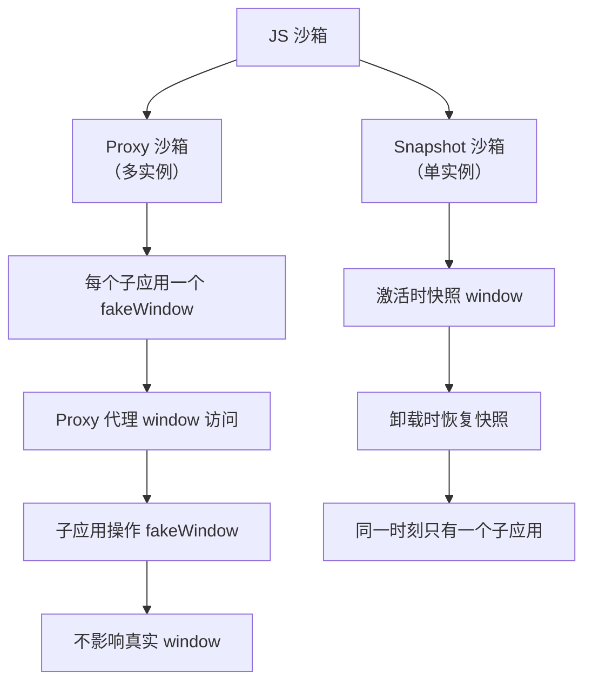

## 微前端核心理念

微前端借鉴了后端微服务的思想：将一个大型前端应用拆分为多个小型、独立、可自治的子应用，各自独立开发、部署、运行。

**适用场景**：
- 多团队协作的大型产品（如 ERP、SaaS 平台）
- 技术栈渐进式迁移（旧 jQuery 逐步替换为 React）
- 不同模块的发布节奏不一致

**不适用的场景**：小型项目、单一团队、技术栈统一——不要为了微前端而微前端。



## 集成方案对比

| 方案 | 隔离性 | 集成度 | 技术栈限制 | 性能 | 复杂度 |
|------|--------|--------|------------|------|--------|
| iframe | 完美隔离 | 低 | 无 | 差（额外进程） | 低 |
| Web Components | 样式隔离 | 中 | 无 | 好 | 中 |
| Module Federation | 共享运行时 | 高 | 无 | 好 | 中 |
| qiankun | JS+样式隔离 | 高 | 无 | 好 | 高 |

### iframe 方案

```html
<iframe
  src="https://sub-app.example.com"
  style="width: 100%; height: 100%; border: none;"
></iframe>
```

优点：天然隔离，最简单。缺点：性能差（每个 iframe 独立进程）、URL 不同步、弹窗无法溢出、通信受限。

### Web Components

```javascript
class MicroApp extends HTMLElement {
  connectedCallback() {
    const shadow = this.attachShadow({ mode: "open" });
    shadow.innerHTML = `
      <style>
        :host { display: block; } /* 样式隔离 */
      </style>
      <div id="app"></div>
    `;
    // 在 shadow DOM 中挂载子应用
    mountSubApp(shadow.querySelector("#app"));
  }
  disconnectedCallback() {
    unmountSubApp();
  }
}
customElements.define("micro-app", MicroApp);
```

优点：浏览器原生支持、Shadow DOM 样式隔离。缺点：JS 不隔离、生态不如主流框架、调试困难。

### Module Federation

```javascript
// 主应用 webpack.config.js
new ModuleFederationPlugin({
  name: "host",
  remotes: {
    dashboard: "dashboard@https://dashboard.example.com/remoteEntry.js",
    settings: "settings@https://settings.example.com/remoteEntry.js",
  },
  shared: {
    react: { singleton: true, requiredVersion: "^18" },
    "react-dom": { singleton: true, requiredVersion: "^18" },
  },
});

// 子应用 dashboard/webpack.config.js
new ModuleFederationPlugin({
  name: "dashboard",
  filename: "remoteEntry.js",
  exposes: {
    "./App": "./src/App",
  },
  shared: { react: { singleton: true }, "react-dom": { singleton: true } },
});
```

```jsx
// 主应用中使用
const DashboardApp = React.lazy(() => import("dashboard/App"));

function App() {
  return (
    <Suspense fallback="加载中...">
      <DashboardApp />
    </Suspense>
  );
}
```

优点：运行时集成、共享依赖、真正按需加载。缺点：共享版本冲突风险、构建配置复杂。

### qiankun

qiankun 基于 single-spa 封装，提供开箱即用的 JS 沙箱和样式隔离：

```javascript
// 主应用
import { registerMicroApps, start } from "qiankun";

registerMicroApps([
  {
    name: "dashboard",
    entry: "//dashboard.example.com",
    container: "#subapp-container",
    activeRule: "/dashboard",
  },
  {
    name: "settings",
    entry: "//settings.example.com",
    container: "#subapp-container",
    activeRule: "/settings",
  },
]);

start({ prefetch: "all", sandbox: { strictStyleIsolation: true } });
```

```javascript
// 子应用导出生命周期
export async function bootstrap() { /* 初始化 */ }
export async function mount(props) {
  ReactDOM.render(<App />, props.container.querySelector("#root"));
}
export async function unmount(props) {
  ReactDOM.unmountComponentAtNode(props.container.querySelector("#root"));
}
```

## JS 沙箱隔离

qiankun 提供两种 JS 沙箱：



**Proxy 沙箱**：为每个子应用创建 `fakeWindow`，通过 Proxy 拦截 `window` 的读写操作。多实例安全，性能略好。

**Snapshot 沙箱**：激活子应用时记录 `window` 快照，卸载时恢复。兼容性好（不支持 Proxy 的环境），但只能单实例运行。

## 样式隔离

| 策略 | 实现方式 | 效果 |
|------|----------|------|
| StrictStyleIsolation | Shadow DOM | 完全隔离，但弹窗等挂载到 body 的样式失效 |
| ExperimentalStyleIsolation | 运行时加 scoped 前缀 | 基本隔离，动态插入的样式可能泄漏 |
| CSS Modules / Scoped CSS | 编译时处理 | 推荐，框架层面隔离 |
| CSS 命名约定 | BEM 等 | 简单但依赖团队规范 |

**推荐做法**：主应用与子应用使用不同的 CSS 前缀，子应用内部使用 CSS Modules 或 Scoped CSS。Shadow DOM 方案在弹窗、下拉菜单等场景下有兼容性问题。

## 微前端治理

### 公共依赖管理

```javascript
// externals 方案 — CDN 加载公共库
// webpack.config.js
module.exports = {
  externals: {
    react: "React",
    "react-dom": "ReactDOM",
  },
};

// HTML 中统一引入
<script src="https://cdn.example.com/react/18/react.production.min.js"></script>
<script src="https://cdn.example.com/react/18/react-dom.production.min.js"></script>
```

### 子应用通信

```javascript
// 简单方案：CustomEvent
window.dispatchEvent(new CustomEvent("user-login", { detail: { userId: 1 } }));
window.addEventListener("user-login", (e) => console.log(e.detail));

// 中等方案：共享状态（initGlobalState）
import { initGlobalState } from "qiankun";
const { onGlobalStateChange, setGlobalState } = initGlobalState({
  user: null,
});
onGlobalStateChange((state) => { /* 全局状态变更 */ });
setGlobalState({ user: { name: "Alice" } });

// 复杂方案：微前端消息总线 + 本地存储
```

### 版本与部署治理

- 每个子应用独立 CI/CD，独立版本号
- 主应用配置子应用版本映射表，支持灰度发布
- 子应用入口提供版本信息接口，主应用做兼容性检查
- 回滚策略：子应用异常时自动降级到上一版本
