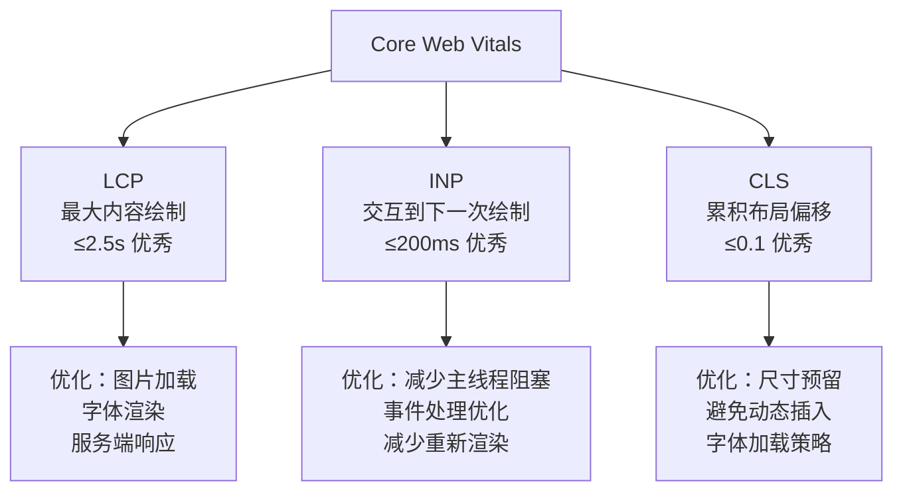
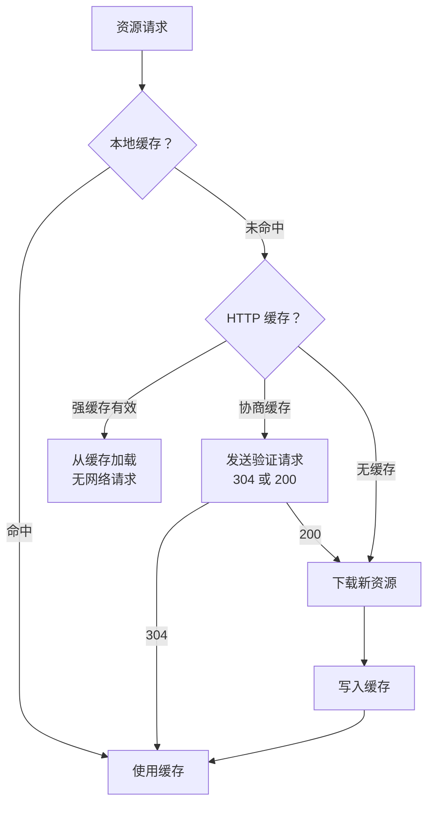

## Core Web Vitals 指标体系

Core Web Vitals 是 Google 定义的三项关键用户体验指标：



| 指标 | 含义 | 优秀阈值 | 测量工具 |
|------|------|----------|----------|
| LCP | 视口内最大内容元素的渲染时间 | ≤2.5s | Lighthouse、Web Vitals |
| INP | 用户交互到下一次绘制的延迟 | ≤200ms | Chrome UX Report |
| CLS | 页面生命周期内意外布局偏移的累计分数 | ≤0.1 | Lighthouse、Web Vitals |

### 测量方式

```javascript
// 使用 web-vitals 库真实用户测量
import { onLCP, onINP, onCLS } from "web-vitals";

onLCP((metric) => reportToAnalytics("LCP", metric));
onINP((metric) => reportToAnalytics("INP", metric));
onCLS((metric) => reportToAnalytics("CLS", metric));
```

**实验室数据**（Lighthouse）vs **真实用户数据**（RUM）：实验室数据可控可重复，真实数据反映实际体验。两者结合才是完整的性能画像。

## 资源优化

### 代码分割

```javascript
// 路由级别懒加载
const Dashboard = React.lazy(() => import("./pages/Dashboard"));
const Settings = React.lazy(() => import("./pages/Settings"));

function App() {
  return (
    <Suspense fallback={<Loading />}>
      <Routes>
        <Route path="/dashboard" element={<Dashboard />} />
        <Route path="/settings" element={<Settings />} />
      </Routes>
    </Suspense>
  );
}

// Vite 动态导入自动代码分割
// import("./heavy-module") → 生成独立 chunk
```

### 图片优化

```html
<!-- 响应式图片：根据视口加载不同尺寸 -->


<!-- 现代格式 + 回退 -->
<picture>
  <source srcset="photo.avif" type="image/avif" />
  <source srcset="photo.webp" type="image/webp" />
  
</picture>
```

格式对比：AVIF（最小，~50% 比 JPEG）> WebP（~30% 比 JPEG）> JPEG/PNG。

### 字体加载

```css
@font-face {
  font-family: "MyFont";
  src: url("/fonts/myfont.woff2") format("woff2");
  font-display: swap; /* 先用系统字体，加载完替换 */
}

/* 预加载关键字体 */
/* <link rel="preload" href="/fonts/myfont.woff2" as="font" crossorigin /> */
```

`font-display: swap` 避免 FOIT（Flash of Invisible Text），但会产生 FOUT（Flash of Unstyled Text）。使用 `size-adjust` 可以减少字体切换时的布局偏移。

## 运行时优化

### 虚拟列表

当列表项超过数百时，DOM 节点过多导致渲染卡顿。虚拟列表只渲染可视区域内的项目：


```jsx
import { useVirtualizer } from "@tanstack/react-virtual";

function LargeList({ items }) {
  const parentRef = useRef();
  const virtualizer = useVirtualizer({
    count: items.length,
    getScrollElement: () => parentRef.current,
    estimateSize: () => 50, // 每项高度
  });

  return (
    <div ref={parentRef} style={{ height: "600px", overflow: "auto" }}>
      <div style={{ height: virtualizer.getTotalSize() }}>
        {virtualizer.getVirtualItems().map((item) => (
          <div
            key={item.index}
            style={{
              position: "absolute",
              top: item.start,
              height: item.size,
            }}
          >
            {items[item.index].name}
          </div>
        ))}
      </div>
    </div>
  );
}
```


### Web Worker

将 CPU 密集型任务移到 Worker 线程，避免阻塞主线程：

```javascript
// main.js
const worker = new Worker("./sort-worker.js");
worker.postMessage({ data: largeArray });
worker.onmessage = (e) => {
  renderSortedData(e.data);
};

// sort-worker.js
self.onmessage = (e) => {
  const sorted = heavySort(e.data.data);
  self.postMessage(sorted);
};
```

### requestIdleCallback

在浏览器空闲时执行低优先级任务：

```javascript
function processAnalytics(queue) {
  if (queue.length === 0) return;
  requestIdleCallback((deadline) => {
    while (deadline.timeRemaining() > 0 && queue.length > 0) {
      sendAnalytics(queue.shift());
    }
    processAnalytics(queue); // 未处理完，下次空闲继续
  });
}
```

## 缓存策略



### HTTP 缓存

```nginx
# Nginx 配置
# 不可变资源（含 hash）— 强缓存 1 年
location /assets/ {
  expires 1y;
  add_header Cache-Control "public, immutable";
}

# HTML — 协商缓存
location / {
  add_header Cache-Control "no-cache";
}
```

### Service Worker

```javascript
// sw.js — 缓存优先策略
self.addEventListener("fetch", (event) => {
  event.respondWith(
    caches.match(event.request).then((cached) => {
      return cached || fetch(event.request).then((response) => {
        const clone = response.clone();
        caches.open("v1").then((cache) => cache.put(event.request, clone));
        return response;
      });
    })
  );
});
```

Workbox 提供了更完善的缓存策略库：CacheFirst、NetworkFirst、StaleWhileRevalidate 等。

## 性能监控

```javascript
// 使用 PerformanceObserver 监控长任务
const observer = new PerformanceObserver((list) => {
  for (const entry of list.getEntries()) {
    if (entry.duration > 50) {
      reportLongTask({
        duration: entry.duration,
        name: entry.name,
        startTime: entry.startTime,
      });
    }
  }
});
observer.observe({ type: "longtask", buffered: true });

// 资源加载监控
const resourceObserver = new PerformanceObserver((list) => {
  for (const entry of list.getEntries()) {
    if (entry.transferSize > 100 * 1024) {
      reportLargeResource({
        name: entry.name,
        size: entry.transferSize,
        duration: entry.duration,
      });
    }
  }
});
resourceObserver.observe({ type: "resource", buffered: true });
```

性能优化的核心思路：**测量 → 分析 → 优化 → 验证**。没有数据支撑的优化是盲目优化。
