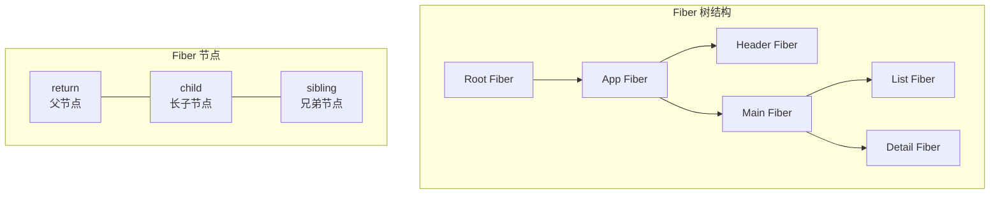
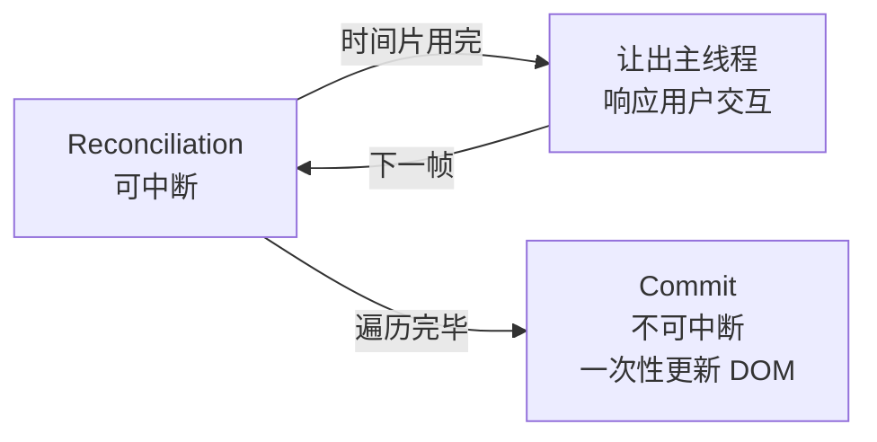
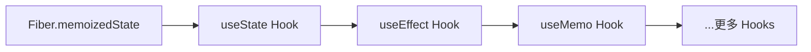

## JSX 编译原理与 Virtual DOM

JSX 不是模板语法，而是 `React.createElement()` 的语法糖：

```jsx
// JSX 写法
const element = <h1 className="title">Hello</h1>;

// 编译结果
const element = React.createElement("h1", { className: "title" }, "Hello");

// createElement 返回的结构
{
  type: "h1",
  props: { className: "title", children: "Hello" }
}
```

**Virtual DOM** 是 JS 对象对真实 DOM 的轻量描述。React 通过对比前后两棵 Virtual DOM 树的差异（Reconciliation），计算出最小更新操作，再批量应用到真实 DOM。

### Diff 算法三大策略

1. **Tree Diff**：只对比同一层级的节点，不跨层级比较——O(n) 复杂度
2. **Component Diff**：同一类型组件继续对比子树，不同类型直接替换
3. **Element Diff**：同层同级节点通过 `key` 标识，支持高效重排序

## Fiber 架构

React 16 重写了核心算法，引入 Fiber 架构——将渲染工作拆分为小单元，支持**可中断渲染**。



每个 Fiber 节点是一个工作单元，包含：
- **静态结构**：type、key、props
- **树遍历指针**：child（第一个子节点）、sibling（下一个兄弟）、return（父节点）
- **副作用**：effectTag（增/删/改）、nextEffect（副作用链表）

### 时间切片

Fiber 的工作流程：在每一帧的空闲时间（`requestIdleCallback` / `MessageChannel`）执行 Fiber 节点的处理。如果时间用完还没处理完，就暂停并让出主线程，下一帧继续。这就是**可中断渲染**——不会长时间阻塞用户交互。



## Hooks 实现原理

Hooks 的核心是一个**链表**，存储在 Fiber 节点的 `memoizedState` 属性上：



每次渲染时，Hooks 按调用顺序依次取出链表中的状态。**这就是为什么 Hooks 不能在条件语句中使用**——顺序变化会导致状态错位。

```javascript
// 错误：条件内使用 Hook
if (condition) {
  const [value, setValue] = useState(0); // 顺序不稳定
}

// 正确：Hook 在顶层调用
const [value, setValue] = useState(0);
if (condition) {
  // 使用 value
}
```

### 常用 Hooks 原理

- **useState**：闭包 + 链表节点。`setState` 将新值入队，触发重渲染时从链表取出最新值
- **useEffect**：渲染完毕后执行回调，通过 `nextEffect` 链表串联，卸载时执行清理函数
- **useMemo/useCallback**：对比依赖数组，依赖不变则复用缓存值
- **useRef**：在 Fiber 节点上持久化一个可变引用，跨渲染周期保持不变

## 状态管理演进

| 方案 | 适用场景 | 特点 |
|------|----------|------|
| useState/useReducer | 组件内 | 轻量，够用就不加库 |
| Context | 跨组件共享 | 避免 prop drilling，但不适合高频更新 |
| Redux | 大型应用 | 单一 Store、纯函数 Reducer、中间件生态 |
| Zustand | 中大型应用 | 极简 API、无需 Provider、基于订阅 |
| Jotai | 原子化状态 | 细粒度更新、自动依赖追踪 |

```javascript
// Zustand — 极简状态管理
import { create } from "zustand";

const useStore = create((set) => ({
  user: null,
  login: (user) => set({ user }),
  logout: () => set({ user: null }),
}));

// 任何组件直接使用，无需 Provider
function Avatar() {
  const user = useStore((s) => s.user);
  return ;
}
```

## React 18+ 并发特性

### useTransition

将状态更新标记为"低优先级"，不阻塞用户输入：

```jsx
function SearchPage() {
  const [query, setQuery] = useState("");
  const [results, setResults] = useState([]);
  const [isPending, startTransition] = useTransition();

  function handleChange(e) {
    setQuery(e.target.value); // 高优先级：立即更新输入框
    startTransition(() => {
      setResults(search(e.target.value)); // 低优先级：可中断的搜索
    });
  }

  return (
    <>
      <input value={query} onChange={handleChange} />
      {isPending && <Spinner />}
      <ResultsList items={results} />
    </>
  );
}
```

### Suspense

声明式地等待异步数据加载：

```jsx
<Suspense fallback={<Loading />}>
  <UserProfile /> {/* 内部 throw Promise 触发 Suspense */}
</Suspense>
```

React 18 的 Suspense 配合 Concurrent Rendering，可以实现**选择性水合（Selective Hydration）**——优先响应用户正在交互的区域，其余区域延后水合。

## 6. React 19 新特性

### 6.1 React Compiler

React Compiler（原 React Forget）是 Meta 开发的自动优化编译器，无需手动使用 useMemo/useCallback：

- **自动记忆化**：编译器分析组件依赖，自动插入记忆化逻辑
- **零侵入**：现有代码无需修改，编译时优化
- **开发体验**：不再需要思考"这里该不该 memo"

### 6.2 Server Actions

```jsx
// 服务端操作 — 直接在组件中定义
async function CreatePost() {
  async function createAction(formData) {
    'use server';
    const title = formData.get('title');
    await db.posts.create({ title });
    revalidatePath('/posts');
  }

  return (
    <form action={createAction}>
      <input name="title" />
      <button type="submit">创建</button>
    </form>
  );
}
```

### 6.3 use() Hook

```jsx
// 在渲染时读取 Promise 和 Context
function Post({ postPromise }) {
  const post = use(postPromise);
  return <h1>{post.title}</h1>;
}
```

## 7. 性能优化实践

### 7.1 React.memo 与渲染优化

```jsx
// 精确控制组件重渲染
const ExpensiveList = React.memo(function ExpensiveList({ items, onSelect }) {
  return items.map(item => (
    <Item key={item.id} item={item} onSelect={onSelect} />
  ));
}, (prev, next) => {
  return prev.items.length === next.items.length;
});
```

### 7.2 代码分割与懒加载

```jsx
const HeavyComponent = React.lazy(() => import('./HeavyComponent'));

function App() {
  return (
    <Suspense fallback={<Skeleton />}>
      <HeavyComponent />
    </Suspense>
  );
}
```

### 7.3 虚拟列表

对于长列表渲染（1000+ 项），使用 react-window 或 @tanstack/virtual：


```jsx
import { useVirtualizer } from '@tanstack/react-virtual';

function VirtualList({ items }) {
  const parentRef = useRef(null);

  const virtualizer = useVirtualizer({
    count: items.length,
    getScrollElement: () => parentRef.current,
    estimateSize: () => 50,
  });

  return (
    <div ref={parentRef} style={{ height: '600px', overflow: 'auto' }}>
      <div style={{ height: virtualizer.getTotalSize() }}>
        {virtualizer.getVirtualItems().map(virtualRow => (
          <div key={virtualRow.key} style={{
            position: 'absolute',
            top: 0,
            transform: `translateY(${virtualRow.start}px)`,
            height: virtualRow.size,
          }}>
            {items[virtualRow.index].name}
          </div>
        ))}
      </div>
    </div>
  );
}
```


## 8. 错误边界

```jsx
class ErrorBoundary extends React.Component {
  constructor(props) {
    super(props);
    this.state = { hasError: false, error: null };
  }

  static getDerivedStateFromError(error) {
    return { hasError: true, error };
  }

  componentDidCatch(error, errorInfo) {
    console.error('Error caught by boundary:', error, errorInfo);
  }

  render() {
    if (this.state.hasError) {
      return this.props.fallback || <h1>Something went wrong.</h1>;
    }
    return this.props.children;
  }
}

// 使用方式
<ErrorBoundary fallback={<ErrorPage />}>
  <App />
</ErrorBoundary>
```
