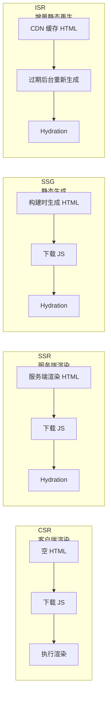
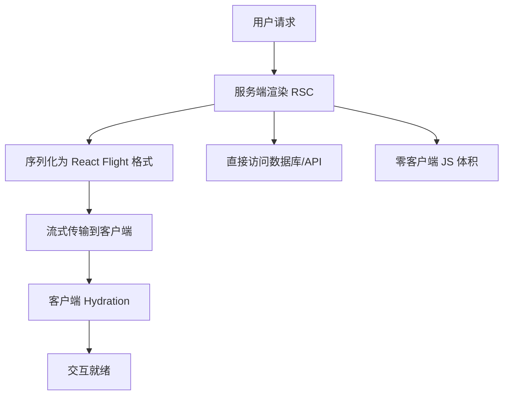
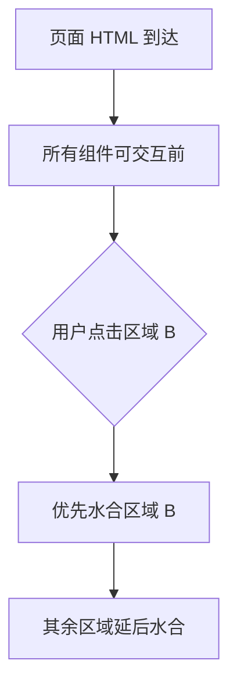

## 渲染模式对比



| 模式 | 渲染时机 | FCP | TTI | SEO | 动态内容 | 适用场景 |
|------|----------|-----|-----|-----|----------|----------|
| CSR | 浏览器 | 慢 | 慢 | 差 | 实时 | 后台管理、工具类 |
| SSR | 请求时 | 快 | 中 | 好 | 支持 | 电商、新闻 |
| SSG | 构建时 | 最快 | 快 | 好 | 不支持 | 博客、文档 |
| ISR | 构建时+定时更新 | 最快 | 快 | 好 | 准实时 | 产品页、博客 |

**关键区别**：SSR 每次请求都渲染（服务器压力大），SSG 构建时一次性生成（内容更新需重新构建），ISR 是 SSG + 后台定时更新（兼顾性能与时效性）。

## Next.js App Router 与 RSC

### React Server Components（RSC）

RSC 允许组件在服务端执行，直接访问数据库和文件系统，结果以序列化格式流式传输到客户端：

```tsx
// Server Component — 默认，标记 async 可直接 await
async function UserProfile({ userId }: { userId: string }) {
  const user = await db.user.findUnique({ where: { id: userId } });
  // 此组件不会发送到客户端，只有渲染结果会
  return (
    <div>
      <h1>{user.name}</h1>
      <p>{user.bio}</p>
    </div>
  );
}

// Client Component — 需要交互时显式标记
"use client";
function LikeButton({ postId }: { postId: string }) {
  const [liked, setLiked] = useState(false);
  return <button onClick={() => setLiked(!liked)}>❤️</button>;
}
```



RSC 的核心价值：**零客户端 JS**——服务端组件的代码不会进入客户端打包产物。大量数据获取和格式化逻辑留在服务端，客户端只接收渲染结果。

### App Router 数据获取

```tsx
// app/posts/page.tsx — 默认就是 Server Component
async function PostsPage() {
  const posts = await fetch("https://api.example.com/posts", {
    next: { revalidate: 3600 }, // ISR：每小时重新验证
  });

  return (
    <main>
      {posts.map((post) => (
        <article key={post.id}>
          <h2>{post.title}</h2>
          <LikeButton postId={post.id} /> {/* Client Component */}
        </article>
      ))}
    </main>
  );
}
```

## Nuxt 3 SSR

### 服务端渲染与 Hydration

Nuxt 3 的 SSR 流程：

1. **服务端**：执行 Vue 组件渲染为 HTML 字符串，发送给浏览器
2. **客户端**：浏览器显示 HTML（用户可立即看到内容），同时下载 JS
3. **Hydration**：Vue 在客户端"激活"静态 HTML，绑定事件、恢复响应式

```typescript
// server/api/user.ts — Nuxt 3 服务端 API
export default defineEventHandler(async (event) => {
  const id = getRouterParam(event, "id");
  const user = await prisma.user.findUnique({ where: { id } });
  return user;
});

// pages/user/[id].vue — 自动 SSR
const route = useRoute();
const { data: user } = await useFetch(`/api/user/${route.params.id}`);
```

### Hydration 注意事项

Hydration 不匹配（Mismatch）是最常见的 SSR 问题——服务端渲染的 HTML 与客户端 Hydration 后的 DOM 不一致：


```vue
<!-- 危险：服务端和客户端时间不同 -->
<template>
  <p>{{ new Date().toLocaleString() }}</p>
</template>

<!-- 安全：客户端挂载后再显示动态内容 -->
<template>
  <p v-if="mounted">{{ currentTime }}</p>
  <p v-else>加载中...</p>
</template>
```


常见原因：使用了 `Date`/`Math.random()`、依赖了浏览器 API（`window`、`document`）、第三方组件的 SSR 行为不一致。

## 流式渲染与 Selective Hydration

### 流式渲染（Streaming SSR）

传统 SSR 必须等所有数据获取完毕才能发送 HTML。流式渲染允许分块发送：

```tsx
// Next.js App Router 默认支持流式渲染
export default function Page() {
  return (
    <main>
      <Header />           {/* 立即渲染 */}
      <Suspense fallback={<Skeleton />}>
        <SlowDataSection /> {/* 数据就绪后流式传输 */}
      </Suspense>
      <Footer />           {/* 立即渲染 */}
    </main>
  );
}
```

用户先看到 Header + Footer + Skeleton，SlowDataSection 的数据就绪后自动替换——无需等待全部数据。

### Selective Hydration

React 18 的并发特性允许**选择性水合**：优先水合用户正在交互的区域。



这意味着页面中较低优先级的模块不会阻塞用户交互。结合 `useTransition`，可以进一步标记水合优先级。

## SSR 性能考量

- **首屏 TTFB**：SSR 增加了服务器响应时间，需要服务端缓存（Redis、CDN）缓解
- **Hydration 体积**：JS 越多 Hydration 越慢，RSC 可以显著减少客户端 JS
- **服务端内存**：每个请求都会创建 Vue/React 实例，高并发时注意内存泄漏
- **缓存策略**：静态页面 CDN 边缘缓存，动态页面 Redis 缓存渲染结果

```nginx
# Nginx SSR 缓存配置
proxy_cache_path /var/cache/ssr levels=1:2 keys_zone=ssr:10m;

location / {
  proxy_cache ssr;
  proxy_cache_valid 200 10m;
  proxy_pass http://ssr_server;
  add_header X-Cache-Status $upstream_cache_status;
}
```
