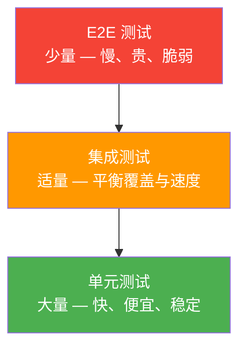
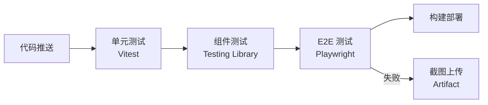

## 测试金字塔



| 层级 | 数量 | 速度 | 覆盖范围 | 维护成本 |
|------|------|------|----------|----------|
| 单元测试 | 多 | 毫秒级 | 函数/模块 | 低 |
| 集成测试 | 中 | 秒级 | 组件交互 | 中 |
| E2E 测试 | 少 | 秒~分钟级 | 用户流程 | 高 |

**核心原则**：底层单元测试多而快，顶层 E2E 少而稳。倒金字塔（E2E 多、单元少）会导致 CI 又慢又脆弱。

## Vitest/Jest 单元测试

Vitest 是 Vite 原生的测试框架，兼容 Jest API 但更快：

```typescript
// math.ts
export function add(a: number, b: number) { return a + b; }
export function divide(a: number, b: number) {
  if (b === 0) throw new Error("除数不能为零");
  return a / b;
}

// math.test.ts
import { describe, it, expect } from "vitest";
import { add, divide } from "./math";

describe("add", () => {
  it("两数相加", () => {
    expect(add(1, 2)).toBe(3);
  });

  it("处理负数", () => {
    expect(add(-1, 1)).toBe(0);
  });
});

describe("divide", () => {
  it("正常除法", () => {
    expect(divide(6, 3)).toBe(2);
  });

  it("除零抛出异常", () => {
    expect(() => divide(1, 0)).toThrow("除数不能为零");
  });
});
```

### Mock 与 Spy

```typescript
import { vi } from "vitest";

// Mock 整个模块
vi.mock("./api", () => ({
  fetchUser: vi.fn(() => Promise.resolve({ name: "Alice" })),
}));

// Spy 追踪调用
const callback = vi.fn();
button.click();
expect(callback).toHaveBeenCalledTimes(1);

// 模拟定时器
vi.useFakeTimers();
setTimeout(callback, 1000);
vi.advanceTimersByTime(1000);
expect(callback).toHaveBeenCalled();
```

## Testing Library 组件测试

Testing Library 的哲学：**以用户的方式测试组件**——通过文本、角色、标签查找元素，而非测试实现细节。

```jsx
// UserList.jsx
function UserList({ users }) {
  return (
    <ul>
      {users.map((user) => (
        <li key={user.id}>{user.name}</li>
      ))}
    </ul>
  );
}

// UserList.test.jsx
import { render, screen } from "@testing-library/react";
import UserList from "./UserList";

it("渲染用户列表", () => {
  const users = [
    { id: 1, name: "Alice" },
    { id: 2, name: "Bob" },
  ];
  render(<UserList users={users} />);
  expect(screen.getByText("Alice")).toBeInTheDocument();
  expect(screen.getByText("Bob")).toBeInTheDocument();
});
```

### 查询优先级

1. **getByRole** — 最佳，模拟屏幕阅读器
2. **getByLabelText** — 表单字段
3. **getByText** — 按钮和链接
4. **getByTestId** — 最后手段，无法通过语义查询时使用

```jsx
// 推荐
screen.getByRole("button", { name: "提交" });
screen.getByLabelText("用户名");

// 不推荐 — 测试实现细节
container.querySelector(".submit-btn");
```

### 用户交互测试

```jsx
import { render, screen, fireEvent } from "@testing-library/react";
import userEvent from "@testing-library/user-event";

it("表单提交", async () => {
  const user = userEvent.setup();
  const onSubmit = vi.fn();
  render(<LoginForm onSubmit={onSubmit} />);

  await user.type(screen.getByLabelText("用户名"), "alice");
  await user.type(screen.getByLabelText("密码"), "secret");
  await user.click(screen.getByRole("button", { name: "登录" }));

  expect(onSubmit).toHaveBeenCalledWith({
    username: "alice",
    password: "secret",
  });
});
```

`userEvent` 比 `fireEvent` 更真实——它模拟完整的用户交互链（聚焦、输入、失焦）。

## E2E 测试与 CI 集成

### Playwright

```typescript
// e2e/login.spec.ts
import { test, expect } from "@playwright/test";

test("用户登录流程", async ({ page }) => {
  await page.goto("/login");

  await page.fill('[data-testid="username"]', "alice");
  await page.fill('[data-testid="password"]', "secret");
  await page.click('button:has-text("登录")');

  await expect(page).toHaveURL("/dashboard");
  await expect(page.locator(".welcome")).toContainText("欢迎, Alice");
});
```

Playwright 优势：跨浏览器（Chromium/Firefox/WebKit）、自动等待、网络拦截、截图对比。

### CI 集成

```yaml
# .github/workflows/test.yml
name: Test
on: [push, pull_request]
jobs:
  test:
    runs-on: ubuntu-latest
    steps:
      - uses: actions/checkout@v4
      - uses: actions/setup-node@v4
        with: { node-version: 20 }
      - run: npm ci
      - run: npm run test:unit
      - run: npm run test:e2e
      - uses: actions/upload-artifact@v4
        if: failure()
        with:
          name: playwright-report
          path: playwright-report/
```



## 视觉回归测试

视觉回归测试通过截图对比发现 UI 意外变更：

```bash
# Playwright 视觉对比
npx playwright test --update-snapshots  # 更新基准截图
```

```typescript
test("按钮样式未变", async ({ page }) => {
  await page.goto("/components/button");
  await expect(page.locator(".button")).toHaveScreenshot("button.png", {
    maxDiffPixelRatio: 0.01, // 允许 1% 像素差异
  });
});
```

**Chromatic**（Storybook 团队出品）提供云端视觉回归服务：每次 PR 自动截图对比，在 Review 中标注视觉变更。

视觉回归测试最适合：组件库、设计系统、品牌页面——任何样式不能意外变更的场景。
