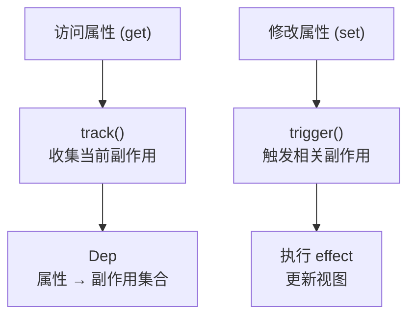
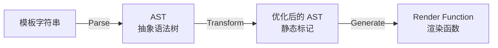
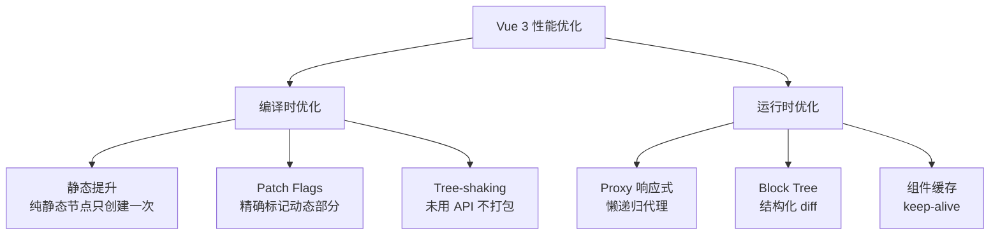

## Vue 3 响应式原理

Vue 3 使用 `Proxy` 替代 `Object.defineProperty` 实现响应式，解决了 Vue 2 的两大痛点：无法检测属性新增/删除、无法检测数组索引直接赋值。

### Proxy 代理与依赖收集



```javascript
// 简化版响应式实现
const targetMap = new WeakMap(); // 存储依赖关系

function reactive(target) {
  return new Proxy(target, {
    get(obj, key, receiver) {
      track(obj, key); // 依赖收集：记录"谁在读这个属性"
      return Reflect.get(obj, key, receiver);
    },
    set(obj, key, value, receiver) {
      const result = Reflect.set(obj, key, value, receiver);
      trigger(obj, key); // 触发更新：通知"这个属性变了"
      return result;
    },
  });
}
```

**track**：当 `effect`（副作用函数）执行时读取属性，将此 effect 记录到该属性的 Dep 中。

**trigger**：属性被修改时，从 Dep 中取出所有依赖的 effect 并执行。

### 嵌套对象与深度响应

Vue 3 采用**懒递归**策略：只有当内层属性被访问时才递归代理，而非初始化时深度遍历。这大幅提升了大型对象的初始化性能。

```javascript
const state = reactive({
  user: { name: "Alice" }, // user 对象在首次访问时才被代理
  items: [],               // 数组同理
});
```

## Composition API 设计哲学

Options API（Vue 2）按选项类型组织代码：data、methods、computed、watch 分散在不同选项中。当组件功能变复杂时，同一功能的代码被拆到多个选项，来回跳转。

Composition API 按**逻辑关注点**组织代码：

```javascript
// 同一功能的代码聚合在一起
function useUser() {
  const user = ref(null);
  const loading = ref(false);

  async function fetchUser(id) {
    loading.value = true;
    user.value = await api.getUser(id);
    loading.value = false;
  }

  return { user, loading, fetchUser };
}

function usePosts(userId) {
  const posts = ref([]);

  watch(userId, (id) => {
    api.getPosts(id).then((data) => (posts.value = data));
  });

  return { posts };
}

// 组件中使用
export default {
  setup() {
    const { user, loading, fetchUser } = useUser();
    const { posts } = usePosts(computed(() => user.value?.id));
    return { user, loading, fetchUser, posts };
  },
};
```

**复用模式对比**：

| 模式 | Vue 2 Mixins | Composition API |
|------|-------------|-----------------|
| 命名冲突 | 可能冲突 | 显式解构，可控 |
| 来源追踪 | 不清楚来自哪个 mixin | 清晰的函数调用 |
| 类型推导 | 困难 | 完整 TypeScript 支持 |

## 模板编译

Vue 模板编译三阶段：



### Parse：模板 → AST


```html
<div class="app">
  <p>{{ message }}</p>
  <span v-if="show">可见内容</span>
</div>
```


解析为 AST 节点树，每个节点包含 type、props、children 等信息。

### Transform：静态标记

编译器识别静态子树并标记：

- **静态提升（HoistStatic）**：纯静态节点只创建一次，后续渲染直接复用
- **Patch Flag**：动态节点标记变更类型（TEXT=1、CLASS=2、PROPS=8...），diff 时只检查标记部分
- **Block Tree**：将模板按结构化指令（v-if/v-for）切分为 Block，diff 时跳过静态块

### Generate：AST → 渲染函数

```javascript
// 编译结果（简化）
import { createElementVNode as _createVNode, toDisplayString as _toDisplayString } from "vue";

export function render(_ctx) {
  return _createVNode("div", { class: "app" }, [
    _createVNode("p", null, _toDisplayString(_ctx.message), 1 /* TEXT */),
    _ctx.show ? _createVNode("span", null, "可见内容") : null,
  ]);
}
```

末尾的 `1 /* TEXT */` 就是 Patch Flag——运行时只需检查 `message` 这一个绑定是否变化。

## Vue Router 与 Pinia

### Vue Router 4

```javascript
const router = createRouter({
  history: createWebHistory(),
  routes: [
    { path: "/", component: Home },
    { path: "/user/:id", component: User, props: true },
    {
      path: "/admin",
      component: Admin,
      children: [{ path: "settings", component: Settings }],
    },
  ],
});

// 导航守卫
router.beforeEach((to, from) => {
  if (to.meta.requiresAuth && !isAuthenticated()) {
    return "/login";
  }
});
```

### Pinia 状态管理

```javascript
// 定义 Store
export const useUserStore = defineStore("user", () => {
  const user = ref(null);
  const isLoggedIn = computed(() => !!user.value);

  async function login(credentials) {
    user.value = await api.login(credentials);
  }

  return { user, isLoggedIn, login };
});

// 组件中使用
const userStore = useUserStore();
userStore.login({ email, password });
```

Pinia 相比 Vuex：去掉了 Mutations（同步操作直接写），支持 Composition API 风格定义，完整的 TypeScript 推导，更小的体积。

## Vue 3 性能优化



- **Tree-shaking**：Vue 3 将全局 API 改为具名导出，未使用的功能（如 `v-model`、`transition`）不会进入打包产物，基础运行时仅约 13KB gzip
- **静态提升**：`<div class="static">内容</div>` 这类节点只创建一次 VNode，每次渲染复用引用
- **Patch Flags**：diff 时只检查动态绑定的部分，跳过静态属性，大幅减少对比开销
