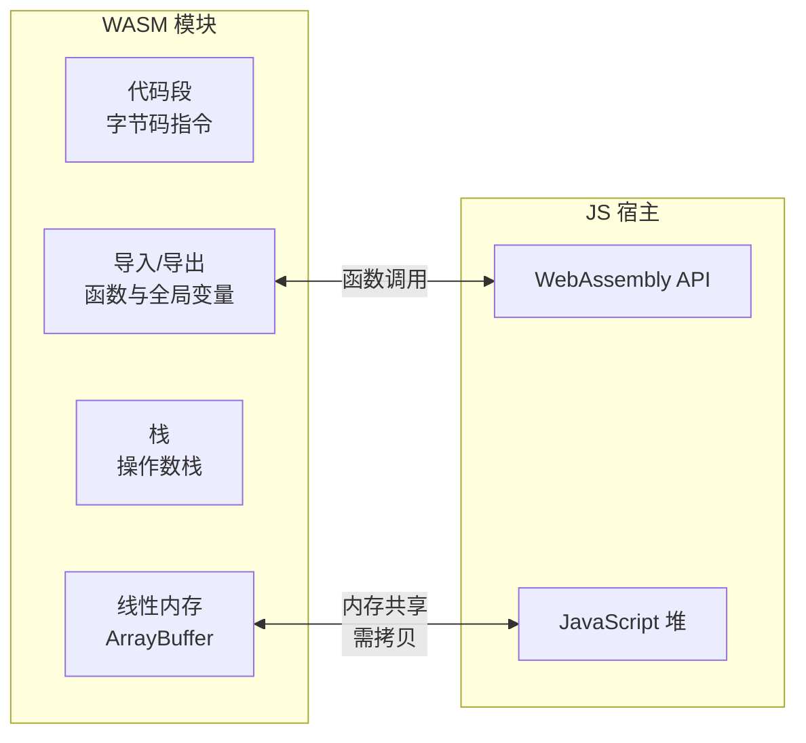
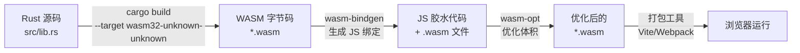
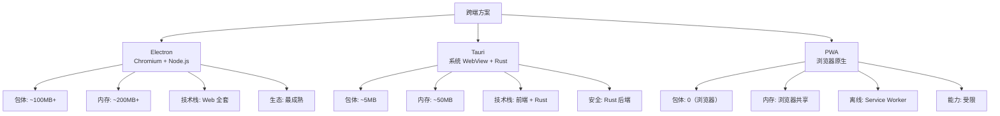
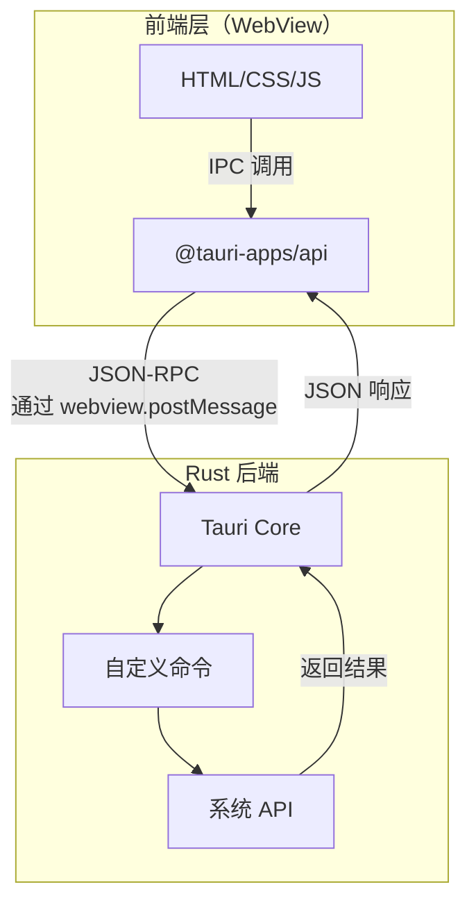

## WebAssembly 原理

WebAssembly（WASM）是一种低级字节码格式，可以在浏览器中以接近原生的速度运行。它不是用来替代 JavaScript 的，而是与 JS 协同——JS 处理 UI 和业务逻辑，WASM 处理计算密集型任务。

### WASM 字节码与线性内存模型

WASM 的核心设计：

- **栈式虚拟机**：操作数通过虚拟栈传递，指令从栈顶取值、压入结果
- **线性内存**：一块连续的可增长字节数组（ArrayBuffer），WASM 模块通过偏移量读写。与 JS 堆内存隔离，互操作需拷贝
- **类型系统**：只有四种基本类型——i32、i64、f32、f64



### JS 与 WASM 的互操作

```javascript
// 加载和实例化 WASM 模块
const { instance } = await WebAssembly.instantiateStreaming(
  fetch("math.wasm")
);

// 调用 WASM 导出函数
const result = instance.exports.fibonacci(40);

// 向 WASM 内存写入数据
const memory = instance.exports.memory;
const buffer = new Uint8Array(memory.buffer);
const text = new TextEncoder().encode("Hello WASM");
const offset = instance.exports.allocate(text.length);
buffer.set(text, offset);

// 从 WASM 内存读取结果
const outputLength = instance.exports.process(offset, text.length);
const output = new TextDecoder().decode(
  buffer.slice(offset, offset + outputLength)
);
```

**关键瓶颈**：JS 与 WASM 之间的数据传递需要经过线性内存的拷贝。对于小型数据，通信开销可能抵消 WASM 的性能优势。

## Rust → WASM 编译流程

Rust 是编写 WASM 的首选语言——零成本抽象、无 GC、与 WASM 的值语义天然契合。



### wasm-bindgen 示例

```rust
// src/lib.rs
use wasm_bindgen::prelude::*;

#[wasm_bindgen]
pub fn fibonacci(n: u32) -> u32 {
    if n <= 1 { return n; }
    let (mut a, mut b) = (0, 1);
    for _ in 2..=n {
        let temp = b;
        b = a + b;
        a = temp;
    }
    b
}

// 接受 JS 字符串，返回 JS 字符串
#[wasm_bindgen]
pub fn process_text(input: &str) -> String {
    input.to_uppercase()
}

// 操作 DOM
#[wasm_bindgen]
pub fn set_title(title: &str) {
    let document = web_sys::window().unwrap().document().unwrap();
    document.set_title(title);
}
```

```javascript
// JS 端使用
import init, { fibonacci, process_text } from "./pkg/my_wasm.js";

async function run() {
  await init(); // 初始化 WASM 模块
  console.log(fibonacci(40));      // 102334155 — 极快
  console.log(process_text("hello")); // "HELLO"
}
```

## WASM 性能场景

WASM 的优势在于**计算密集型**任务，而非所有场景：

| 场景 | WASM 优势 | 典型案例 |
|------|-----------|----------|
| 图像/视频处理 | 2-10x | 图片压缩、视频编解码 |
| 加密/哈希 | 5-20x | SHA-256、AES 加密 |
| 游戏/物理引擎 | 3-10x | 碰撞检测、粒子系统 |
| 数据压缩 | 2-5x | Gzip、Zstandard |
| 表达式求值 | 5-15x | SQL 解析、公式计算 |
| DOM 操作 | ❌ 更慢 | 通信开销超过计算收益 |
| 字符串处理 | ≈ | 通信开销抵消优势 |

**核心判断**：计算量大、数据传输量小 → WASM 合算；计算量小、数据传输量大 → JS 更快。

```javascript
// 实际基准测试：Fibonacci(40)
// JS:    ~1200ms
// WASM:  ~12ms
// 100x 差异，因为这是纯计算，无内存通信开销

// 实际基准测试：处理 1MB JSON
// JS:    ~15ms
// WASM:  ~25ms（序列化/反序列化开销 15ms + 计算 10ms）
```

## 跨端方案对比



| 特性 | Electron | Tauri | PWA |
|------|----------|-------|-----|
| 打包体积 | ~100MB+ | ~5-10MB | 0（浏览器） |
| 内存占用 | 高（独立 Chromium） | 低（系统 WebView） | 共享浏览器进程 |
| 系统访问 | 完整（Node.js） | 完整（Rust 命令） | 受限（Web API） |
| 跨平台 | Win/Mac/Linux | Win/Mac/Linux | 任意浏览器 |
| 原生体验 | 一般 | 好 | 取决于实现 |
| 更新机制 | 全量更新 | 全量/增量 | 自动（SW） |
| 开发门槛 | 低（纯 Web） | 中（需 Rust） | 低（纯 Web） |

### Tauri 架构

Tauri 采用**前端 + Rust 后端**的双层架构：



```rust
// src-tauri/src/main.rs
#[tauri::command]
fn greet(name: &str) -> String {
    format!("你好, {}!", name)
}

#[tauri::command]
fn read_file(path: String) -> Result<String, String> {
    std::fs::read_to_string(&path).map_err(|e| e.to_string())
}

fn main() {
    tauri::Builder::default()
        .invoke_handler(tauri::generate_handler![greet, read_file])
        .run(tauri::generate_context!())
        .expect("启动失败");
}
```

```javascript
// 前端调用 Rust 命令
import { invoke } from "@tauri-apps/api/core";

const greeting = await invoke("greet", { name: "世界" });
const content = await invoke("read_file", { path: "/tmp/data.txt" });
```

Tauri 的安全模型：默认最小权限，每个命令都需要在 `capabilities` 中显式声明授权。这比 Electron 的"全部权限"模型更安全。

## 选型建议

- **桌面应用、团队纯前端**：Electron，生态成熟、学习曲线低
- **桌面应用、追求性能与体积**：Tauri，包体小、内存低、Rust 后端强大
- **轻量级、无需安装**：PWA，浏览器原生支持、自动更新
- **计算密集型 Web 功能**：WASM（Rust），性能提升显著
- **混合方案**：Tauri + WASM，前端 UI + Rust 后端 + WASM 高性能计算

前端技术的边界正在不断扩展——从浏览器到桌面，从 JS 到 WASM，从单页应用到跨端融合。理解每种技术的适用场景，才能做出正确的架构选择。
