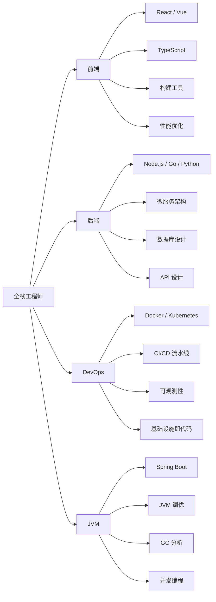

## 关于本站

格物致知（GWZZ）是一个专注于软件工程技术的知识库，内容涵盖前端开发、后端架构、DevOps 实践以及 JVM 生态等方向。我们相信，深入理解技术本质，才能构建系统化的认知体系。

## 关于作者

一名热爱技术的全栈工程师，长期从事后端架构设计与性能优化工作，同时对前端工程化和云原生技术保持着浓厚兴趣。

**技术方向**：
- 后端架构：微服务设计、分布式系统、高可用方案
- JVM 生态：Java/Kotlin 开发、性能调优、GC 优化
- DevOps：容器化部署、Kubernetes 运维、CI/CD 自动化
- 前端工程：现代框架、组件化架构、性能优化

**开源贡献**：活跃于 GitHub 社区，参与和维护多个开源项目。

## 技能图谱

## 写作理念

- **体系化**：每个领域从基础原理到实战应用，构建完整的知识图谱，而非零散的知识点堆砌
- **深入本质**：不仅告诉你"怎么做"，更深入探讨"为什么"，理解技术背后的设计哲学
- **实战导向**：每个知识点都配有真实的代码示例和架构图，确保学以致用
- **双语同步**：中英文对照输出，面向更广泛的技术社区，也作为自身的英语锻炼

## 内容范围

- **Frontend** — 现代前端框架与工具链，组件化架构与响应式设计
- **Backend** — 服务端开发，RESTful API 设计，微服务架构
- **DevOps** — 容器化、编排、CI/CD 自动化工作流
- **JVM Ecosystem** — Java、Kotlin、Scala，Spring Boot、Akka、Spark，JVM 性能调优与构建工具

## 技术栈

本站基于 Jekyll 构建，使用自定义 GitHub 风格主题，支持深色/浅色主题切换，部署在 GitHub Pages。

## 联系方式

- **邮箱**：zhouxunyou@gmail.com
- **GitHub**：[zhouxunyou](https://github.com/zhouxunyou)
- **博客**：[gwzz.xyz](https://gwzz.xyz)
