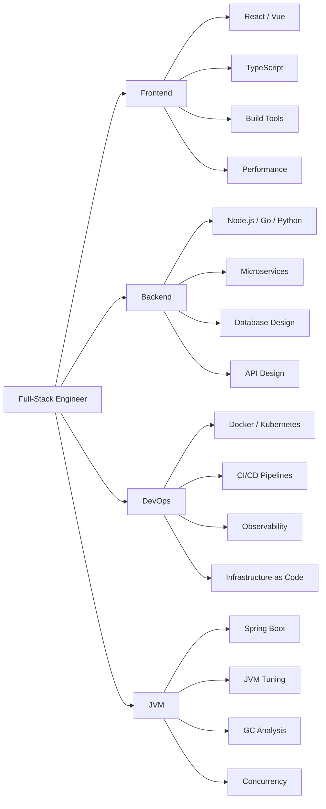

## About This Site

GWZZ (格物致知 — Investigate Things to Extend Knowledge) is a knowledge base focused on software engineering, covering frontend development, backend architecture, DevOps practices, and the JVM ecosystem. We believe that understanding the essence of technology is the key to building a systematic cognitive framework.

## About the Author

A full-stack engineer passionate about technology, with extensive experience in backend architecture design and performance optimization, while maintaining a strong interest in frontend engineering and cloud-native technologies.

**Technical Focus**:
- Backend Architecture: Microservice design, distributed systems, high availability solutions
- JVM Ecosystem: Java/Kotlin development, performance tuning, GC optimization
- DevOps: Containerized deployment, Kubernetes operations, CI/CD automation
- Frontend Engineering: Modern frameworks, component architecture, performance optimization

**Open Source**: Active on GitHub, contributing to and maintaining several open-source projects.

## Skill Stack

## Writing Philosophy

- **Systematic**: Each domain builds a complete knowledge graph from fundamentals to practical applications, not just scattered facts
- **Deep Understanding**: Not just "how to do it", but exploring "why" — understanding the design philosophy behind the technology
- **Practice-Oriented**: Every concept comes with real code examples and architecture diagrams, ensuring knowledge is actionable
- **Bilingual**: Content published in both Chinese and English, reaching a broader tech community while serving as language practice

## Content Scope

- **Frontend** — Modern frontend frameworks and toolchains, component-based architectures, and responsive design
- **Backend** — Server-side development, RESTful API design, microservices architecture
- **DevOps** — Containerization, orchestration, CI/CD automation workflows
- **JVM Ecosystem** — Java, Kotlin, Scala, Spring Boot, Akka, Spark, JVM performance tuning and build tools

## Tech Stack

This site is built with Jekyll, using a custom GitHub-style theme with dark/light theme support, deployed on GitHub Pages.

## Get in Touch

- **Email**: gwzz@gwzz.xyz
- **GitHub**: [zhouxunyou](https://github.com/zhouxunyou)
- **Blog**: [gwzz.xyz](https://gwzz.xyz)
